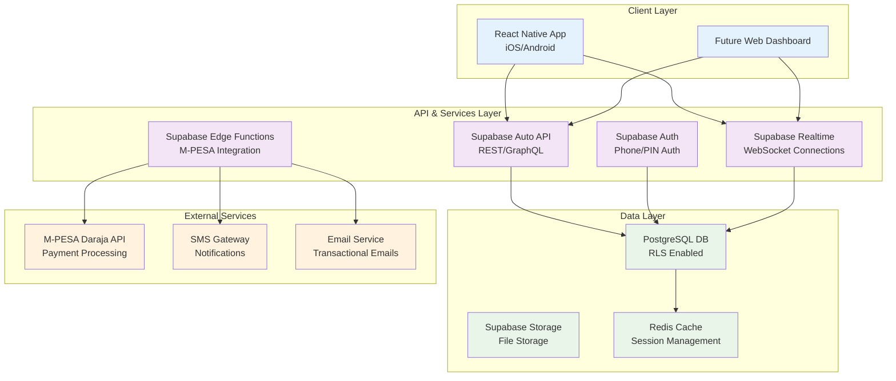
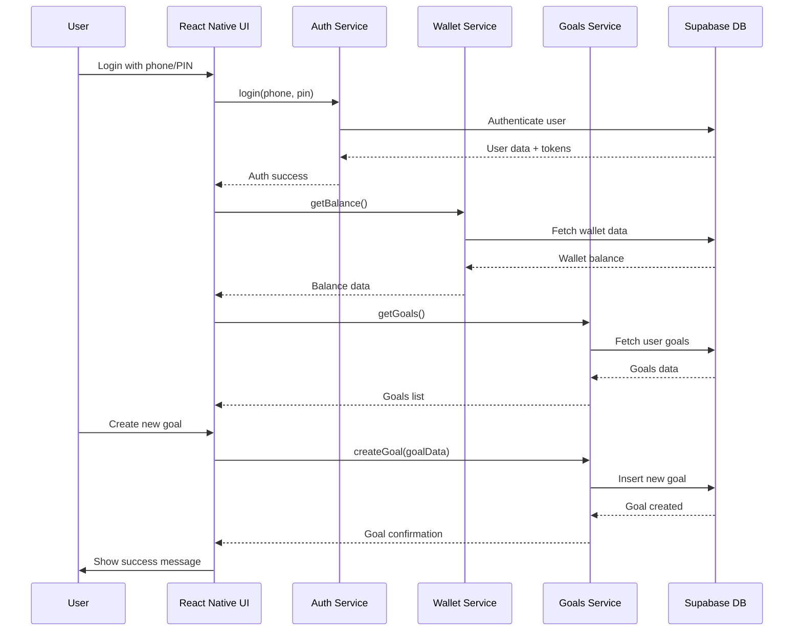
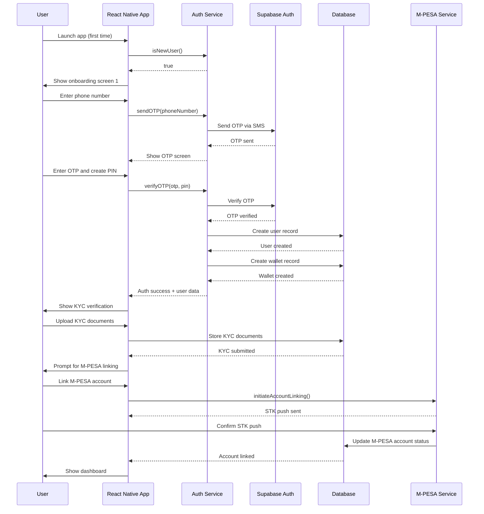
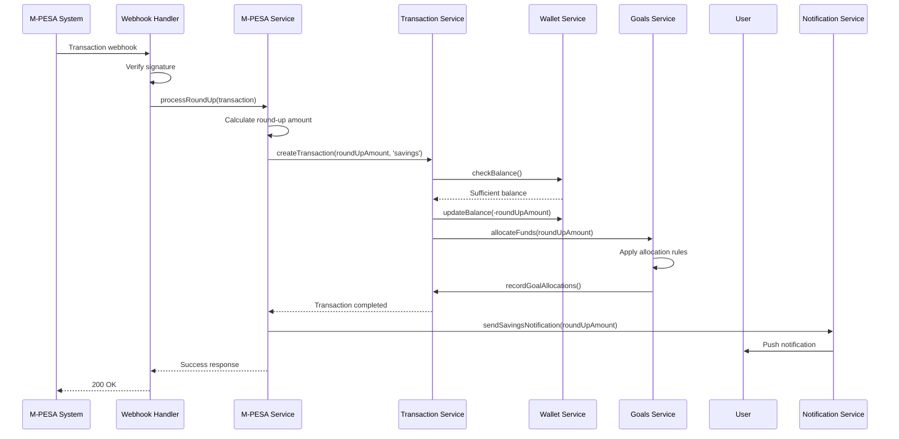
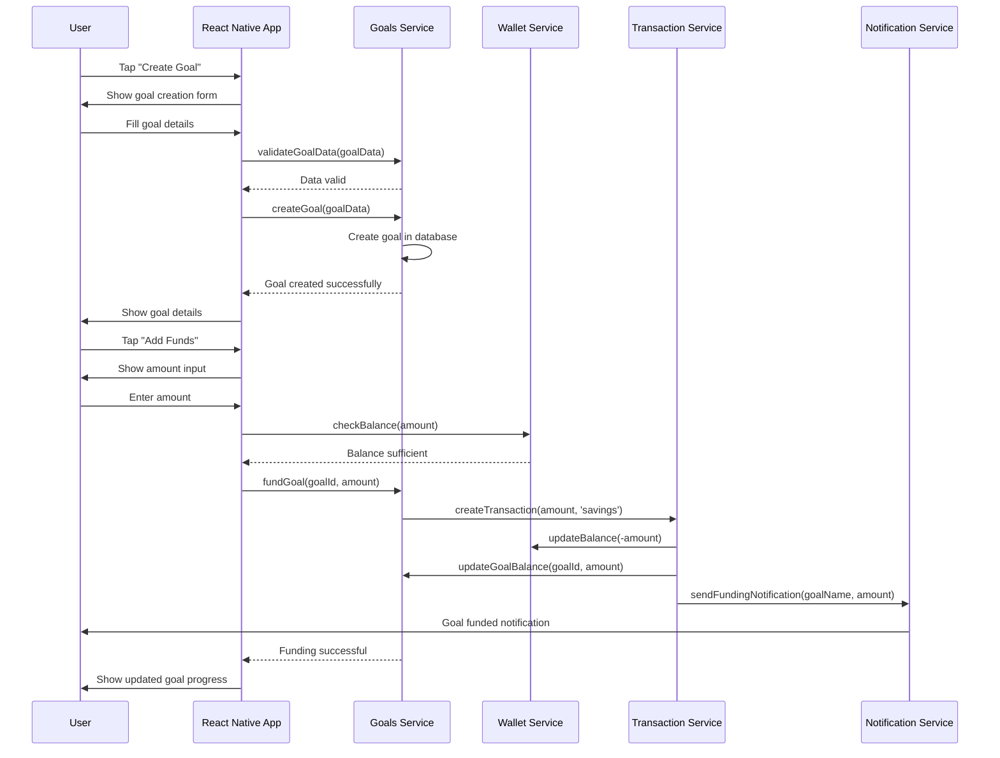
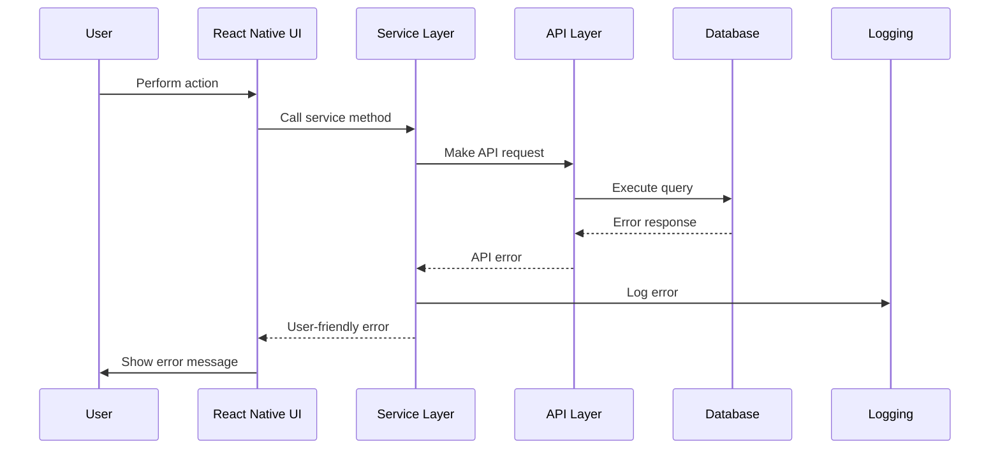

# Zanari Fullstack Architecture Document

## Introduction

This document outlines the complete fullstack architecture for Zanari, including backend systems, frontend implementation, and their integration. It serves as the single source of truth for AI-driven development, ensuring consistency across the entire technology stack.

This unified approach combines what would traditionally be separate backend and frontend architecture documents, streamlining the development process for modern fullstack applications where these concerns are increasingly intertwined.

### Starter Template or Existing Project

**Status:** Greenfield project with predefined technical choices

Based on the PRD requirements, this project will be built from scratch using:
- **Mobile Framework:** React Native with TypeScript
- **Backend Platform:** Supabase (PostgreSQL, Auth, Edge Functions)
- **Repository Structure:** Monorepo with shared packages
- **Target Platform:** iOS and Android mobile applications

### Change Log

| Date | Version | Description | Author |
| :--- | :--- | :--- | :--- |
| 2025-09-18 | 1.0 | Initial fullstack architecture document | Winston (Architect) |

## High Level Architecture

### Technical Summary

Zanari will implement a serverless architecture using Supabase as the primary Backend-as-a-Service platform, combined with a React Native mobile application. The system leverages automated savings through M-PESA integration, providing users with a seamless experience for building financial resilience. The architecture prioritizes scalability, security, and compliance with Kenyan data protection regulations while maintaining a rapid development cycle for the MVP.

### Platform and Infrastructure Choice

**Platform:** Supabase Cloud (with migration plan to Kenyan cloud provider)

**Key Services:**
- **Database:** Supabase PostgreSQL with Row Level Security (RLS)
- **Authentication:** Supabase Auth with phone number and PIN verification
- **API Layer:** Supabase Auto-generated REST API + Edge Functions
- **Storage:** Supabase Storage for user documents and assets
- **Real-time:** Supabase Real-time for instant balance updates
- **Functions:** Supabase Edge Functions for M-PESA integration and complex business logic

**Deployment Host and Regions:**
- **Initial:** Supabase Cloud (US/EU regions)
- **Post-MVP:** Self-hosted Supabase on Kenyan cloud provider (AWS Africa, Azure South Africa)

**Rationale:** Supabase provides a complete BaaS solution that accelerates development while maintaining scalability. The serverless approach reduces operational overhead and allows focus on business logic rather than infrastructure management.

### Repository Structure

**Structure:** Monorepo with Nx or Turborepo

**Monorepo Tool:** Nx (preferred) or Turborepo

**Package Organization:**
```
zanari/
├── apps/
│   ├── mobile/              # React Native app
│   └── web/                 # Future web dashboard
├── packages/
│   ├── shared/              # Shared TypeScript types and utilities
│   ├── ui/                  # Shared UI components
│   ├── data/               # Data models and validation schemas
│   └── config/             # Shared configuration
├── supabase/               # Database migrations and edge functions
├── docs/                   # Documentation
└── infrastructure/         # IaC for future self-hosting
```

**Rationale:** Monorepo enables code sharing between mobile and future web applications, consistent TypeScript types across the stack, and unified development tooling.

### High Level Architecture Diagram



### Architectural Patterns

- **Jamstack Architecture:** Static mobile app with serverless APIs - *Rationale:* Optimal performance and security for financial applications*
- **Component-Based UI:** Reusable React Native components with TypeScript - *Rationale:* Maintainability and type safety across large codebases*
- **Repository Pattern:** Abstract data access logic through service layer - *Rationale:* Enables testing and future database migration flexibility*
- **API Gateway Pattern:** Supabase as single entry point for all data operations - *Rationale:* Centralized auth, rate limiting, and monitoring*
- **Event-Driven Architecture:** Webhook-based transaction processing - *Rationale:* Real-time processing of M-PESA transactions*
- **CQRS Pattern:** Separate read and write operations for complex queries - *Rationale:* Optimized performance for analytics and reporting*
- **Microfrontend Architecture:** Independent mobile and web apps - *Rationale:* Platform-specific optimization while sharing business logic*

## Tech Stack

### Technology Stack Table

| Category | Technology | Version | Purpose | Rationale |
|----------|------------|---------|---------|-----------|
| **Frontend Language** | TypeScript | 5.0+ | Type safety and developer experience | Static typing catches errors early, improves code quality |
| **Frontend Framework** | React Native | 0.73+ | Cross-platform mobile development | Single codebase for iOS and Android, mature ecosystem |
| **UI Component Library** | React Native Paper | 5.0+ | Material Design components | Consistent UI, accessibility, theming support |
| **State Management** | Zustand | 4.0+ | Global state management | Simple API, small bundle size, good performance |
| **Backend Language** | TypeScript | 5.0+ | Edge Functions and shared types | Consistent typing across fullstack |
| **Backend Framework** | Supabase Edge Functions | Latest | Serverless functions | Auto-scaling, integrated with Supabase ecosystem |
| **API Style** | REST + GraphQL | - | Data access patterns | REST for mutations, GraphQL for complex queries |
| **Database** | PostgreSQL | 15+ | Primary data store | ACID compliance, RLS, JSONB support |
| **Cache** | Redis | 7.0+ | Session and query caching | Fast in-memory caching for frequently accessed data |
| **File Storage** | Supabase Storage | - | Document and asset storage | Integrated with RLS, CDN delivery |
| **Authentication** | Supabase Auth | - | User authentication | Phone-based auth, RLS integration, sessions |
| **Frontend Testing** | Jest + React Native Testing Library | Latest | Unit and integration tests | Comprehensive testing solution, good developer experience |
| **Backend Testing** | Jest + Supertest | Latest | API and function testing | Reliable testing, good mocking capabilities |
| **E2E Testing** | Detox | Latest | End-to-end testing | Real device testing, gray box testing |
| **Build Tool** | Nx | 16.0+ | Monorepo management | Task orchestration, caching, dependency graph |
| **Bundler** | Metro Bundler | - | React Native bundling | Optimized for mobile, fast refresh |
| **IaC Tool** | Terraform | 1.5+ | Infrastructure as Code | Cloud-agnostic, state management, modules |
| **CI/CD** | GitHub Actions | - | Continuous integration/deployment | Native GitHub integration, marketplace actions |
| **Monitoring** | Sentry | - | Error tracking and performance | Real-time alerts, performance monitoring |
| **Logging** | Winston + Supabase Logs | - | Application logging | Structured logging, search, retention |
| **CSS Framework** | React Native Paper | 5.0+ | Styling and theming | Built-in theming, responsive design |

## Data Models

### User

**Purpose:** Core user entity representing Zanari account holders

**Key Attributes:**
- id: uuid - Primary key from Supabase Auth
- phone_number: string - User's phone number (unique)
- pin_hash: string - Hashed PIN for authentication
- first_name: string - User's first name
- last_name: string - User's last name
- email: string - Optional email address
- date_of_birth: date - User's date of birth
- kyc_status: 'pending' | 'verified' | 'rejected' - KYC verification status
- kyc_document_url: string - URL to KYC document
- is_active: boolean - Account status
- created_at: timestamp - Account creation timestamp
- updated_at: timestamp - Last update timestamp

**TypeScript Interface:**
```typescript
interface User {
  id: string;
  phone_number: string;
  pin_hash: string;
  first_name: string;
  last_name: string;
  email?: string;
  date_of_birth: string;
  kyc_status: 'pending' | 'verified' | 'rejected';
  kyc_document_url?: string;
  is_active: boolean;
  created_at: string;
  updated_at: string;
}
```

**Relationships:**
- One-to-many with Wallet (user has one wallet)
- One-to-many with SavingsGoal (user has multiple goals)
- One-to-many with Transaction (user has multiple transactions)
- One-to-many with MpesaAccount (user can link multiple M-PESA accounts)

### Wallet

**Purpose:** Primary wallet for storing user's funds

**Key Attributes:**
- id: uuid - Primary key
- user_id: uuid - Foreign key to User
- balance: decimal - Current wallet balance
- currency: string - Currency code (KES)
- created_at: timestamp - Wallet creation timestamp
- updated_at: timestamp - Last update timestamp

**TypeScript Interface:**
```typescript
interface Wallet {
  id: string;
  user_id: string;
  balance: number;
  currency: string;
  created_at: string;
  updated_at: string;
}
```

**Relationships:**
- Many-to-one with User (belongs to user)
- One-to-many with Transaction (source of transactions)

### SavingsGoal

**Purpose:** User-defined savings goals with targets and deadlines

**Key Attributes:**
- id: uuid - Primary key
- user_id: uuid - Foreign key to User
- name: string - Goal name
- description?: string - Optional goal description
- target_amount: decimal - Target amount to save
- current_amount: decimal - Currently saved amount
- target_date?: date - Optional target date
- icon_emoji?: string - Emoji/icon for goal
- status: 'active' | 'completed' | 'paused' - Goal status
- created_at: timestamp - Goal creation timestamp
- updated_at: timestamp - Last update timestamp

**TypeScript Interface:**
```typescript
interface SavingsGoal {
  id: string;
  user_id: string;
  name: string;
  description?: string;
  target_amount: number;
  current_amount: number;
  target_date?: string;
  icon_emoji?: string;
  status: 'active' | 'completed' | 'paused';
  created_at: string;
  updated_at: string;
}
```

**Relationships:**
- Many-to-one with User (belongs to user)
- One-to-many with GoalAllocation (funds allocated to this goal)
- One-to-many with Transaction (transactions related to this goal)

### Transaction

**Purpose:** Records all financial transactions in the system

**Key Attributes:**
- id: uuid - Primary key
- user_id: uuid - Foreign key to User
- wallet_id: uuid - Foreign key to Wallet
- type: 'deposit' | 'withdrawal' | 'savings' | 'refund' - Transaction type
- amount: decimal - Transaction amount
- currency: string - Currency code (KES)
- description: string - Transaction description
- reference_number?: string - External reference number
- status: 'pending' | 'completed' | 'failed' - Transaction status
- savings_goal_id?: uuid - Foreign key to SavingsGoal (if applicable)
- mpesa_transaction_id?: string - M-PESA transaction reference
- created_at: timestamp - Transaction timestamp
- updated_at: timestamp - Last update timestamp

**TypeScript Interface:**
```typescript
interface Transaction {
  id: string;
  user_id: string;
  wallet_id: string;
  type: 'deposit' | 'withdrawal' | 'savings' | 'refund';
  amount: number;
  currency: string;
  description: string;
  reference_number?: string;
  status: 'pending' | 'completed' | 'failed';
  savings_goal_id?: string;
  mpesa_transaction_id?: string;
  created_at: string;
  updated_at: string;
}
```

**Relationships:**
- Many-to-one with User (belongs to user)
- Many-to-one with Wallet (belongs to wallet)
- Many-to-one with SavingsGoal (optional association with goal)

### MpesaAccount

**Purpose:** Linked M-PESA accounts for automatic savings

**Key Attributes:**
- id: uuid - Primary key
- user_id: uuid - Foreign key to User
- phone_number: string - M-PESA registered phone number
- account_name: string - M-PESA account holder name
- is_active: boolean - Account linkage status
- is_default: boolean - Default account for round-ups
- round_up_enabled: boolean - Round-up savings enabled
- round_up_amount: decimal - Round-up amount (KES 10)
- daily_limit?: decimal - Daily savings limit
- last_transaction_date?: date - Last transaction processed
- created_at: timestamp - Account linking timestamp
- updated_at: timestamp - Last update timestamp

**TypeScript Interface:**
```typescript
interface MpesaAccount {
  id: string;
  user_id: string;
  phone_number: string;
  account_name: string;
  is_active: boolean;
  is_default: boolean;
  round_up_enabled: boolean;
  round_up_amount: number;
  daily_limit?: number;
  last_transaction_date?: string;
  created_at: string;
  updated_at: string;
}
```

**Relationships:**
- Many-to-one with User (belongs to user)
- One-to-many with MpesaTransaction (M-PESA transactions processed)

### MpesaTransaction

**Purpose:** Records M-PESA transactions for round-up processing

**Key Attributes:**
- id: uuid - Primary key
- mpesa_account_id: uuid - Foreign key to MpesaAccount
- user_id: uuid - Foreign key to User
- transaction_id: string - M-PESA transaction ID
- transaction_type: string - M-PESA transaction type
- amount: decimal - Original transaction amount
- round_up_amount: decimal - Calculated round-up amount
- processing_status: 'pending' | 'processed' | 'failed' - Processing status
- processed_at?: timestamp - When round-up was processed
- created_at: timestamp - Transaction received timestamp

**TypeScript Interface:**
```typescript
interface MpesaTransaction {
  id: string;
  mpesa_account_id: string;
  user_id: string;
  transaction_id: string;
  transaction_type: string;
  amount: number;
  round_up_amount: number;
  processing_status: 'pending' | 'processed' | 'failed';
  processed_at?: string;
  created_at: string;
}
```

**Relationships:**
- Many-to-one with MpesaAccount (belongs to M-PESA account)
- Many-to-one with User (belongs to user)
- One-to-one with Transaction (generated savings transaction)

### GoalAllocation

**Purpose:** Tracks how savings are allocated across multiple goals

**Key Attributes:**
- id: uuid - Primary key
- user_id: uuid - Foreign key to User
- savings_goal_id: uuid - Foreign key to SavingsGoal
- transaction_id: uuid - Foreign key to Transaction
- amount: decimal - Amount allocated to this goal
- percentage: number - Percentage of total allocation
- created_at: timestamp - Allocation timestamp

**TypeScript Interface:**
```typescript
interface GoalAllocation {
  id: string;
  user_id: string;
  savings_goal_id: string;
  transaction_id: string;
  amount: number;
  percentage: number;
  created_at: string;
}
```

**Relationships:**
- Many-to-one with User (belongs to user)
- Many-to-one with SavingsGoal (belongs to goal)
- Many-to-one with Transaction (belongs to transaction)

## API Specification

### REST API Specification

```yaml
openapi: 3.0.0
info:
  title: Zanari API
  version: 1.0.0
  description: API for Zanari automated savings application
  contact:
    name: Zanari Development Team
    email: dev@zanari.com

servers:
  - url: https://api.zanari.com/v1
    description: Production server
  - url: https://dev-api.zanari.com/v1
    description: Development server

components:
  securitySchemes:
    BearerAuth:
      type: http
      scheme: bearer
      bearerFormat: JWT
    ApiKeyAuth:
      type: apiKey
      in: header
      name: X-API-Key

  schemas:
    User:
      type: object
      properties:
        id:
          type: string
          format: uuid
        phone_number:
          type: string
        first_name:
          type: string
        last_name:
          type: string
        email:
          type: string
        kyc_status:
          type: string
          enum: [pending, verified, rejected]
        is_active:
          type: boolean
        created_at:
          type: string
          format: date-time
        updated_at:
          type: string
          format: date-time

    Wallet:
      type: object
      properties:
        id:
          type: string
          format: uuid
        user_id:
          type: string
          format: uuid
        balance:
          type: number
          format: decimal
        currency:
          type: string
          default: KES
        created_at:
          type: string
          format: date-time
        updated_at:
          type: string
          format: date-time

    SavingsGoal:
      type: object
      properties:
        id:
          type: string
          format: uuid
        user_id:
          type: string
          format: uuid
        name:
          type: string
        description:
          type: string
        target_amount:
          type: number
          format: decimal
        current_amount:
          type: number
          format: decimal
        target_date:
          type: string
          format: date
        icon_emoji:
          type: string
        status:
          type: string
          enum: [active, completed, paused]
        created_at:
          type: string
          format: date-time
        updated_at:
          type: string
          format: date-time

    Transaction:
      type: object
      properties:
        id:
          type: string
          format: uuid
        user_id:
          type: string
          format: uuid
        wallet_id:
          type: string
          format: uuid
        type:
          type: string
          enum: [deposit, withdrawal, savings, refund]
        amount:
          type: number
          format: decimal
        currency:
          type: string
          default: KES
        description:
          type: string
        reference_number:
          type: string
        status:
          type: string
          enum: [pending, completed, failed]
        savings_goal_id:
          type: string
          format: uuid
        mpesa_transaction_id:
          type: string
        created_at:
          type: string
          format: date-time
        updated_at:
          type: string
          format: date-time

    MpesaAccount:
      type: object
      properties:
        id:
          type: string
          format: uuid
        user_id:
          type: string
          format: uuid
        phone_number:
          type: string
        account_name:
          type: string
        is_active:
          type: boolean
        is_default:
          type: boolean
        round_up_enabled:
          type: boolean
        round_up_amount:
          type: number
          format: decimal
        daily_limit:
          type: number
          format: decimal
        last_transaction_date:
          type: string
          format: date
        created_at:
          type: string
          format: date-time
        updated_at:
          type: string
          format: date-time

    ApiResponse:
      type: object
      properties:
        success:
          type: boolean
        data:
          type: object
        error:
          type: object
          properties:
            code:
              type: string
            message:
              type: string
            details:
              type: object
        meta:
          type: object
          properties:
            timestamp:
              type: string
              format: date-time
            request_id:
              type: string
              format: uuid

paths:
  # Authentication endpoints
  /auth/register:
    post:
      summary: Register new user
      tags: [Authentication]
      security: []
      requestBody:
        required: true
        content:
          application/json:
            schema:
              type: object
              properties:
                phone_number:
                  type: string
                  example: "+254712345678"
                pin:
                  type: string
                  example: "1234"
                first_name:
                  type: string
                  example: "John"
                last_name:
                  type: string
                  example: "Doe"
                email:
                  type: string
                  example: "john.doe@example.com"
              required:
                - phone_number
                - pin
                - first_name
                - last_name
      responses:
        '201':
          description: User registered successfully
          content:
            application/json:
              schema:
                allOf:
                  - $ref: '#/components/schemas/ApiResponse'
                  - type: object
                    properties:
                      data:
                        $ref: '#/components/schemas/User'
        '400':
          description: Invalid request data
        '409':
          description: User already exists

  /auth/login:
    post:
      summary: Login user
      tags: [Authentication]
      security: []
      requestBody:
        required: true
        content:
          application/json:
            schema:
              type: object
              properties:
                phone_number:
                  type: string
                  example: "+254712345678"
                pin:
                  type: string
                  example: "1234"
              required:
                - phone_number
                - pin
      responses:
        '200':
          description: Login successful
          content:
            application/json:
              schema:
                allOf:
                  - $ref: '#/components/schemas/ApiResponse'
                  - type: object
                    properties:
                      data:
                        type: object
                        properties:
                          user:
                            $ref: '#/components/schemas/User'
                          access_token:
                            type: string
                          refresh_token:
                            type: string
        '401':
          description: Invalid credentials
        '423':
          description: Account locked

  /auth/logout:
    post:
      summary: Logout user
      tags: [Authentication]
      security:
        - BearerAuth: []
      responses:
        '200':
          description: Logout successful
        '401':
          description: Unauthorized

  # Wallet endpoints
  /wallet:
    get:
      summary: Get user wallet
      tags: [Wallet]
      security:
        - BearerAuth: []
      responses:
        '200':
          description: Wallet retrieved successfully
          content:
            application/json:
              schema:
                allOf:
                  - $ref: '#/components/schemas/ApiResponse'
                  - type: object
                    properties:
                      data:
                        $ref: '#/components/schemas/Wallet'
        '404':
          description: Wallet not found

  # Savings goals endpoints
  /goals:
    get:
      summary: Get user's savings goals
      tags: [Savings Goals]
      security:
        - BearerAuth: []
      parameters:
        - name: status
          in: query
          schema:
            type: string
            enum: [active, completed, paused]
        - name: limit
          in: query
          schema:
            type: integer
            default: 50
        - name: offset
          in: query
          schema:
            type: integer
            default: 0
      responses:
        '200':
          description: Goals retrieved successfully
          content:
            application/json:
              schema:
                allOf:
                  - $ref: '#/components/schemas/ApiResponse'
                  - type: object
                    properties:
                      data:
                        type: array
                        items:
                          $ref: '#/components/schemas/SavingsGoal'
                      meta:
                        type: object
                        properties:
                          total:
                            type: integer
                          limit:
                            type: integer
                          offset:
                            type: integer

    post:
      summary: Create new savings goal
      tags: [Savings Goals]
      security:
        - BearerAuth: []
      requestBody:
        required: true
        content:
          application/json:
            schema:
              type: object
              properties:
                name:
                  type: string
                  example: "New Phone"
                description:
                  type: string
                  example: "Save for a new smartphone"
                target_amount:
                  type: number
                  example: 50000
                target_date:
                  type: string
                  format: date
                  example: "2024-12-31"
                icon_emoji:
                  type: string
                  example: "📱"
              required:
                - name
                - target_amount
      responses:
        '201':
          description: Goal created successfully
          content:
            application/json:
              schema:
                allOf:
                  - $ref: '#/components/schemas/ApiResponse'
                  - type: object
                    properties:
                      data:
                        $ref: '#/components/schemas/SavingsGoal'

  /goals/{goalId}:
    get:
      summary: Get specific savings goal
      tags: [Savings Goals]
      security:
        - BearerAuth: []
      parameters:
        - name: goalId
          in: path
          required: true
          schema:
            type: string
            format: uuid
      responses:
        '200':
          description: Goal retrieved successfully
        '404':
          description: Goal not found

    put:
      summary: Update savings goal
      tags: [Savings Goals]
      security:
        - BearerAuth: []
      parameters:
        - name: goalId
          in: path
          required: true
          schema:
            type: string
            format: uuid
      requestBody:
        required: true
        content:
          application/json:
            schema:
              type: object
              properties:
                name:
                  type: string
                description:
                  type: string
                target_amount:
                  type: number
                target_date:
                  type: string
                  format: date
                icon_emoji:
                  type: string
                status:
                  type: string
                  enum: [active, completed, paused]
      responses:
        '200':
          description: Goal updated successfully
        '404':
          description: Goal not found

    delete:
      summary: Delete savings goal
      tags: [Savings Goals]
      security:
        - BearerAuth: []
      parameters:
        - name: goalId
          in: path
          required: true
          schema:
            type: string
            format: uuid
      responses:
        '204':
          description: Goal deleted successfully
        '404':
          description: Goal not found

  # Goals funding endpoints
  /goals/{goalId}/fund:
    post:
      summary: Add funds to savings goal
      tags: [Savings Goals]
      security:
        - BearerAuth: []
      parameters:
        - name: goalId
          in: path
          required: true
          schema:
            type: string
            format: uuid
      requestBody:
        required: true
        content:
          application/json:
            schema:
              type: object
              properties:
                amount:
                  type: number
                  example: 1000
              required:
                - amount
      responses:
        '200':
          description: Funds added successfully
        '400':
          description: Invalid amount or insufficient funds
        '404':
          description: Goal not found

  # Transaction endpoints
  /transactions:
    get:
      summary: Get user transactions
      tags: [Transactions]
      security:
        - BearerAuth: []
      parameters:
        - name: type
          in: query
          schema:
            type: string
            enum: [deposit, withdrawal, savings, refund]
        - name: status
          in: query
          schema:
            type: string
            enum: [pending, completed, failed]
        - name: start_date
          in: query
          schema:
            type: string
            format: date
        - name: end_date
          in: query
          schema:
            type: string
            format: date
        - name: limit
          in: query
          schema:
            type: integer
            default: 50
        - name: offset
          in: query
          schema:
            type: integer
            default: 0
      responses:
        '200':
          description: Transactions retrieved successfully
          content:
            application/json:
              schema:
                allOf:
                  - $ref: '#/components/schemas/ApiResponse'
                  - type: object
                    properties:
                      data:
                        type: array
                        items:
                          $ref: '#/components/schemas/Transaction'
                      meta:
                        type: object
                        properties:
                          total:
                            type: integer
                          limit:
                            type: integer
                          offset:
                            type: integer

  # M-PESA endpoints
  /mpesa/accounts:
    get:
      summary: Get user's M-PESA accounts
      tags: [M-PESA]
      security:
        - BearerAuth: []
      responses:
        '200':
          description: M-PESA accounts retrieved successfully
          content:
            application/json:
              schema:
                allOf:
                  - $ref: '#/components/schemas/ApiResponse'
                  - type: object
                    properties:
                      data:
                        type: array
                        items:
                          $ref: '#/components/schemas/MpesaAccount'

    post:
      summary: Link M-PESA account
      tags: [M-PESA]
      security:
        - BearerAuth: []
      requestBody:
        required: true
        content:
          application/json:
            schema:
              type: object
              properties:
                phone_number:
                  type: string
                  example: "+254712345678"
              required:
                - phone_number
      responses:
        '201':
          description: M-PESA account linking initiated
        '400':
          description: Invalid phone number

  /mpesa/accounts/{accountId}:
    put:
      summary: Update M-PESA account settings
      tags: [M-PESA]
      security:
        - BearerAuth: []
      parameters:
        - name: accountId
          in: path
          required: true
          schema:
            type: string
            format: uuid
      requestBody:
        required: true
        content:
          application/json:
            schema:
              type: object
              properties:
                is_default:
                  type: boolean
                round_up_enabled:
                  type: boolean
                round_up_amount:
                  type: number
                daily_limit:
                  type: number
      responses:
        '200':
          description: Account updated successfully
        '404':
          description: Account not found

  # Analytics endpoints
  /analytics/savings:
    get:
      summary: Get savings analytics
      tags: [Analytics]
      security:
        - BearerAuth: []
      parameters:
        - name: period
          in: query
          schema:
            type: string
            enum: [7d, 30d, 90d, 1y]
            default: 30d
      responses:
        '200':
          description: Analytics retrieved successfully
          content:
            application/json:
              schema:
                allOf:
                  - $ref: '#/components/schemas/ApiResponse'
                  - type: object
                    properties:
                      data:
                        type: object
                        properties:
                          total_saved:
                            type: number
                          monthly_average:
                            type: number
                          goals_completed:
                            type: integer
                          savings_trend:
                            type: array
                            items:
                              type: object
                              properties:
                                date:
                                  type: string
                                  format: date
                                amount:
                                  type: number

  # Webhook endpoints (external)
  /webhooks/mpesa:
    post:
      summary: M-PESA transaction webhook
      tags: [Webhooks]
      security:
        - ApiKeyAuth: []
      requestBody:
        required: true
        content:
          application/json:
            schema:
              type: object
              properties:
                transaction_type:
                  type: string
                transaction_id:
                  type: string
                transaction_time:
                  type: string
                  format: date-time
                amount:
                  type: number
                phone_number:
                  type: string
                account_reference:
                  type: string
              required:
                - transaction_type
                - transaction_id
                - transaction_time
                - amount
                - phone_number
      responses:
        '200':
          description: Webhook processed successfully
        '400':
          description: Invalid webhook data
        '401':
          description: Invalid API key
```

## Components

### Auth Service

**Responsibility:** User authentication and session management

**Key Interfaces:**
- `register(phoneNumber: string, pin: string, userData: RegisterData): Promise<AuthResponse>`
- `login(phoneNumber: string, pin: string): Promise<AuthResponse>`
- `logout(): Promise<void>`
- `refreshToken(): Promise<AuthResponse>`
- `verifyPin(pin: string): Promise<boolean>`

**Dependencies:**
- Supabase Auth
- Secure storage for tokens
- PIN validation service

**Technology Stack:**
- Supabase Auth client
- React Native Secure Storage
- Biometric authentication (optional)

### Wallet Service

**Responsibility:** Wallet balance management and transaction processing

**Key Interfaces:**
- `getBalance(): Promise<Wallet>`
- `getTransactions(filters?: TransactionFilters): Promise<Transaction[]>`
- `deposit(amount: number, method: PaymentMethod): Promise<Transaction>`
- `withdraw(amount: number, method: PaymentMethod): Promise<Transaction>`

**Dependencies:**
- Supabase Database (wallets, transactions tables)
- Transaction processing service
- Payment gateway integration

**Technology Stack:**
- Supabase Database client
- Transaction queue processor
- Redis for balance caching

### Goals Service

**Responsibility:** Savings goals management and progress tracking

**Key Interfaces:**
- `createGoal(goalData: CreateGoalData): Promise<SavingsGoal>`
- `updateGoal(goalId: string, updates: UpdateGoalData): Promise<SavingsGoal>`
- `deleteGoal(goalId: string): Promise<void>`
- `fundGoal(goalId: string, amount: number): Promise<Transaction>`
- `getGoals(filters?: GoalFilters): Promise<SavingsGoal[]>`

**Dependencies:**
- Supabase Database (savings_goals table)
- Wallet service for balance checks
- Transaction service for recording allocations

**Technology Stack:**
- Supabase Database client
- Goal calculation engine
- Progress tracking algorithms

### M-PESA Service

**Responsibility:** M-PESA integration and round-up processing

**Key Interfaces:**
- `linkAccount(phoneNumber: string): Promise<MpesaAccount>`
- `updateAccountSettings(accountId: string, settings: MpesaSettings): Promise<MpesaAccount>`
- `processRoundUp(transaction: MpesaTransaction): Promise<Transaction>`
- `initiateStkPush(phoneNumber: string, amount: number): Promise<StkResponse>`

**Dependencies:**
- M-PESA Daraja API
- Transaction processing service
- Webhook handler for transaction notifications

**Technology Stack:**
- Supabase Edge Functions
- M-PESA Daraja API client
- Webhook processing

### Analytics Service

**Responsibility:** Savings analytics and reporting

**Key Interfaces:**
- `getSavingsAnalytics(period: AnalyticsPeriod): Promise<SavingsAnalytics>`
- `getGoalProgress(goalId: string): Promise<GoalProgress>`
- `getUserSummary(userId: string): Promise<UserSummary>`

**Dependencies:**
- Supabase Database (transactions, goals tables)
- Data aggregation service
- Chart generation utilities

**Technology Stack:**
- Supabase Database client
- Data aggregation queries
- Chart.js for visualization

### Notification Service

**Responsibility:** In-app notifications and alerts

**Key Interfaces:**
- `sendNotification(userId: string, notification: Notification): Promise<void>`
- `markAsRead(notificationId: string): Promise<void>`
- `getNotifications(userId: string): Promise<Notification[]>`

**Dependencies:**
- Supabase Realtime
- Push notification service
- Local notification storage

**Technology Stack:**
- Supabase Realtime
- React Native Push Notifications
- Local storage

### Component Diagrams

```mermaid
graph TB
    subgraph "Frontend Components"
        A[Auth Screens]
        B[Dashboard Screen]
        C[Goals Screen]
        D[Transactions Screen]
        E[Settings Screen]
        F[Navigation Components]
        G[UI Components Library]
    end

    subgraph "Service Layer"
        H[Auth Service]
        I[Wallet Service]
        J[Goals Service]
        K[M-PESA Service]
        L[Analytics Service]
        M[Notification Service]
    end

    subgraph "Data Layer"
        N[Supabase Client]
        O[Local Storage]
        P[Cache Layer]
    end

    subgraph "External Services"
        Q[M-PESA API]
        R[Push Notification Service]
    end

    A --> H
    B --> I
    B --> L
    C --> J
    C --> L
    D --> I
    D --> M
    E --> H
    E --> K
    F --> G

    H --> N
    I --> N
    J --> N
    K --> N
    L --> N
    M --> N

    H --> O
    I --> P
    J --> P

    K --> Q
    M --> R

    style A fill:#e3f2fd
    style B fill:#e3f2fd
    style C fill:#e3f2fd
    style D fill:#e3f2fd
    style E fill:#e3f2fd
    style F fill:#e3f2fd
    style G fill:#e3f2fd
    style H fill:#f3e5f5
    style I fill:#f3e5f5
    style J fill:#f3e5f5
    style K fill:#f3e5f5
    style L fill:#f3e5f5
    style M fill:#f3e5f5
    style N fill:#e8f5e8
    style O fill:#e8f5e8
    style P fill:#e8f5e8
    style Q fill:#fff3e0
    style R fill:#fff3e0
```



### Component Interactions



## External APIs

### M-PESA Daraja API Integration

**Purpose:** Integrate with Safaricom's M-PESA API for payment processing and round-up savings

**Purpose:** Primary payment integration for automated savings

**Documentation:** https://developer.safaricom.co.ke/docs

**Base URL(s):**
- Sandbox: https://sandbox.safaricom.co.ke
- Production: https://api.safaricom.co.ke

**Authentication:** OAuth 2.0 + API Key

**Rate Limits:**
- Sandbox: 30 requests per minute
- Production: 1000 requests per minute

**Key Endpoints Used:**

#### B2C Payment API
- `POST /mpesa/b2c/v1/paymentrequest`
- **Purpose:** Transfer funds from Zanari to user's M-PESA (withdrawals)
- **Authentication:** OAuth 2.0 Access Token
- **Parameters:** Initiator, SecurityCredential, CommandID, Amount, PartyA, PartyB, Remarks, QueueTimeOutURL, ResultURL

#### C2B Register API
- `POST /mpesa/c2b/v1/registerurl`
- **Purpose:** Register validation and confirmation URLs for C2B transactions
- **Authentication:** OAuth 2.0 Access Token
- **Parameters:** ValidationURL, ConfirmationURL, ResponseType, ShortCode

#### STK Push API
- `POST /mpesa/stkpush/v1/processrequest`
- **Purpose:** Initiate STK push for user confirmation (deposits)
- **Authentication:** OAuth 2.0 Access Token
- **Parameters:** BusinessShortCode, Password, Timestamp, TransactionType, Amount, PartyA, PartyB, PhoneNumber, CallBackURL, AccountReference, TransactionDesc

#### Transaction Status API
- `POST /mpesa/transactionstatus/v1/query`
- **Purpose:** Check status of M-PESA transactions
- **Authentication:** OAuth 2.0 Access Token
- **Parameters:** Initiator, SecurityCredential, CommandID, TransactionID, PartyA, IdentifierType, Remarks, QueueTimeOutURL, ResultURL

**Integration Notes:**

1. **Security Requirements:**
   - All API calls must use HTTPS
   - OAuth tokens must be refreshed every hour
   - Security credentials must be encrypted at rest
   - IP whitelisting required for production

2. **Error Handling:**
   - Implement retry logic with exponential backoff
   - Handle M-PESA specific error codes
   - Log all failed transactions for audit purposes
   - Provide user-friendly error messages

3. **Webhook Processing:**
   - Validation URL: Verify transaction authenticity
   - Confirmation URL: Process completed transactions
   - Implement idempotency for duplicate webhook calls
   - Respond within 30 seconds to prevent timeouts

4. **Rate Limiting:**
   - Implement request queuing during peak times
   - Monitor API usage to avoid limits
   - Implement circuit breaker pattern for API failures
   - Use multiple API keys if needed for scaling

**Webhook Security:**
- Validate M-PESA signatures using shared secret
- Verify transaction IDs to prevent replay attacks
- Implement IP whitelisting for webhook sources
- Log all webhook requests for audit trails

### SMS Gateway API Integration

**Purpose:** Send SMS notifications for transactions and account updates

**Documentation:** Provider-specific (Africa's Talking, Twilio, etc.)

**Base URL(s):** Provider-specific

**Authentication:** API Key + Username/Password

**Rate Limits:** Provider-specific, typically 10-50 messages per second

**Key Endpoints Used:**
- `POST /version1/messaging` - Send SMS messages
- `GET /version1/account` - Check account balance
- `POST /version1/airtime/send` - Send airtime (future feature)

**Integration Notes:**
- Implement message templates for common notifications
- Handle delivery status callbacks
- Optimize for Kenyan number formats
- Implement message queuing for bulk sends

## Core Workflows

### User Onboarding Flow



### M-PESA Round-Up Savings Flow



### Goal Creation and Funding Flow



## Database Schema

### Core Tables

```sql
-- Users table
CREATE TABLE users (
    id UUID REFERENCES auth.users(id) PRIMARY KEY,
    phone_number VARCHAR(20) UNIQUE NOT NULL,
    pin_hash VARCHAR(255) NOT NULL,
    first_name VARCHAR(100) NOT NULL,
    last_name VARCHAR(100) NOT NULL,
    email VARCHAR(255),
    date_of_birth DATE NOT NULL,
    kyc_status VARCHAR(20) DEFAULT 'pending' CHECK (kyc_status IN ('pending', 'verified', 'rejected')),
    kyc_document_url TEXT,
    is_active BOOLEAN DEFAULT true,
    created_at TIMESTAMP WITH TIME ZONE DEFAULT NOW(),
    updated_at TIMESTAMP WITH TIME ZONE DEFAULT NOW()
);

-- Wallets table
CREATE TABLE wallets (
    id UUID PRIMARY KEY DEFAULT gen_random_uuid(),
    user_id UUID REFERENCES users(id) ON DELETE CASCADE NOT NULL UNIQUE,
    balance DECIMAL(15,2) DEFAULT 0.00 NOT NULL CHECK (balance >= 0),
    currency VARCHAR(3) DEFAULT 'KES' NOT NULL,
    created_at TIMESTAMP WITH TIME ZONE DEFAULT NOW(),
    updated_at TIMESTAMP WITH TIME ZONE DEFAULT NOW()
);

-- Savings goals table
CREATE TABLE savings_goals (
    id UUID PRIMARY KEY DEFAULT gen_random_uuid(),
    user_id UUID REFERENCES users(id) ON DELETE CASCADE NOT NULL,
    name VARCHAR(100) NOT NULL,
    description TEXT,
    target_amount DECIMAL(15,2) NOT NULL CHECK (target_amount > 0),
    current_amount DECIMAL(15,2) DEFAULT 0.00 NOT NULL CHECK (current_amount >= 0),
    target_date DATE,
    icon_emoji VARCHAR(10),
    status VARCHAR(20) DEFAULT 'active' CHECK (status IN ('active', 'completed', 'paused')),
    created_at TIMESTAMP WITH TIME ZONE DEFAULT NOW(),
    updated_at TIMESTAMP WITH TIME ZONE DEFAULT NOW()
);

-- Transactions table
CREATE TABLE transactions (
    id UUID PRIMARY KEY DEFAULT gen_random_uuid(),
    user_id UUID REFERENCES users(id) ON DELETE CASCADE NOT NULL,
    wallet_id UUID REFERENCES wallets(id) ON DELETE CASCADE NOT NULL,
    type VARCHAR(20) NOT NULL CHECK (type IN ('deposit', 'withdrawal', 'savings', 'refund')),
    amount DECIMAL(15,2) NOT NULL CHECK (amount > 0),
    currency VARCHAR(3) DEFAULT 'KES' NOT NULL,
    description TEXT NOT NULL,
    reference_number VARCHAR(100),
    status VARCHAR(20) DEFAULT 'pending' CHECK (status IN ('pending', 'completed', 'failed')),
    savings_goal_id UUID REFERENCES savings_goals(id) ON DELETE SET NULL,
    mpesa_transaction_id VARCHAR(100),
    created_at TIMESTAMP WITH TIME ZONE DEFAULT NOW(),
    updated_at TIMESTAMP WITH TIME ZONE DEFAULT NOW()
);

-- M-PESA accounts table
CREATE TABLE mpesa_accounts (
    id UUID PRIMARY KEY DEFAULT gen_random_uuid(),
    user_id UUID REFERENCES users(id) ON DELETE CASCADE NOT NULL,
    phone_number VARCHAR(20) NOT NULL,
    account_name VARCHAR(200) NOT NULL,
    is_active BOOLEAN DEFAULT true,
    is_default BOOLEAN DEFAULT false,
    round_up_enabled BOOLEAN DEFAULT true,
    round_up_amount DECIMAL(10,2) DEFAULT 10.00 CHECK (round_up_amount > 0),
    daily_limit DECIMAL(15,2),
    last_transaction_date DATE,
    created_at TIMESTAMP WITH TIME ZONE DEFAULT NOW(),
    updated_at TIMESTAMP WITH TIME ZONE DEFAULT NOW(),
    UNIQUE(user_id, phone_number)
);

-- M-PESA transactions table (for round-up processing)
CREATE TABLE mpesa_transactions (
    id UUID PRIMARY KEY DEFAULT gen_random_uuid(),
    mpesa_account_id UUID REFERENCES mpesa_accounts(id) ON DELETE CASCADE NOT NULL,
    user_id UUID REFERENCES users(id) ON DELETE CASCADE NOT NULL,
    transaction_id VARCHAR(100) UNIQUE NOT NULL,
    transaction_type VARCHAR(50) NOT NULL,
    amount DECIMAL(15,2) NOT NULL,
    round_up_amount DECIMAL(10,2) NOT NULL,
    processing_status VARCHAR(20) DEFAULT 'pending' CHECK (processing_status IN ('pending', 'processed', 'failed')),
    processed_at TIMESTAMP WITH TIME ZONE,
    created_at TIMESTAMP WITH TIME ZONE DEFAULT NOW()
);

-- Goal allocations table
CREATE TABLE goal_allocations (
    id UUID PRIMARY KEY DEFAULT gen_random_uuid(),
    user_id UUID REFERENCES users(id) ON DELETE CASCADE NOT NULL,
    savings_goal_id UUID REFERENCES savings_goals(id) ON DELETE CASCADE NOT NULL,
    transaction_id UUID REFERENCES transactions(id) ON DELETE CASCADE NOT NULL,
    amount DECIMAL(15,2) NOT NULL CHECK (amount > 0),
    percentage DECIMAL(5,2) NOT NULL CHECK (percentage > 0 AND percentage <= 100),
    created_at TIMESTAMP WITH TIME ZONE DEFAULT NOW(),
    UNIQUE(transaction_id, savings_goal_id)
);

-- Notifications table
CREATE TABLE notifications (
    id UUID PRIMARY KEY DEFAULT gen_random_uuid(),
    user_id UUID REFERENCES users(id) ON DELETE CASCADE NOT NULL,
    type VARCHAR(50) NOT NULL,
    title VARCHAR(200) NOT NULL,
    message TEXT NOT NULL,
    is_read BOOLEAN DEFAULT false,
    metadata JSONB,
    created_at TIMESTAMP WITH TIME ZONE DEFAULT NOW()
);
```

### Indexes for Performance

```sql
-- Performance indexes
CREATE INDEX idx_users_phone ON users(phone_number);
CREATE INDEX idx_users_kyc_status ON users(kyc_status);
CREATE INDEX idx_wallets_user_id ON wallets(user_id);
CREATE INDEX idx_savings_goals_user_id ON savings_goals(user_id);
CREATE INDEX idx_savings_goals_status ON savings_goals(status);
CREATE INDEX idx_transactions_user_id ON transactions(user_id);
CREATE INDEX idx_transactions_type ON transactions(type);
CREATE INDEX idx_transactions_status ON transactions(status);
CREATE INDEX idx_transactions_created_at ON transactions(created_at DESC);
CREATE INDEX idx_mpesa_accounts_user_id ON mpesa_accounts(user_id);
CREATE INDEX idx_mpesa_transactions_user_id ON mpesa_transactions(user_id);
CREATE INDEX idx_mpesa_transactions_status ON mpesa_transactions(processing_status);
CREATE INDEX idx_goal_allocations_user_id ON goal_allocations(user_id);
CREATE INDEX idx_notifications_user_id ON notifications(user_id);
CREATE INDEX idx_notifications_created_at ON notifications(created_at DESC);
```

### Row Level Security (RLS) Policies

```sql
-- Enable RLS
ALTER TABLE users ENABLE ROW LEVEL SECURITY;
ALTER TABLE wallets ENABLE ROW LEVEL SECURITY;
ALTER TABLE savings_goals ENABLE ROW LEVEL SECURITY;
ALTER TABLE transactions ENABLE ROW LEVEL SECURITY;
ALTER TABLE mpesa_accounts ENABLE ROW LEVEL SECURITY;
ALTER TABLE mpesa_transactions ENABLE ROW LEVEL SECURITY;
ALTER TABLE goal_allocations ENABLE ROW LEVEL SECURITY;
ALTER TABLE notifications ENABLE ROW LEVEL SECURITY;

-- Users can only access their own data
CREATE POLICY "Users can view own data" ON users
    FOR SELECT USING (auth.uid() = id);

CREATE POLICY "Users can update own data" ON users
    FOR UPDATE USING (auth.uid() = id);

-- Wallets access policies
CREATE POLICY "Users can view own wallet" ON wallets
    FOR SELECT USING (auth.uid() = user_id);

CREATE POLICY "System can update wallet balances" ON wallets
    FOR UPDATE USING (auth.uid() = user_id);

-- Savings goals access policies
CREATE POLICY "Users can view own goals" ON savings_goals
    FOR SELECT USING (auth.uid() = user_id);

CREATE POLICY "Users can manage own goals" ON savings_goals
    FOR ALL USING (auth.uid() = user_id);

-- Transactions access policies
CREATE POLICY "Users can view own transactions" ON transactions
    FOR SELECT USING (auth.uid() = user_id);

CREATE POLICY "System can insert transactions" ON transactions
    FOR INSERT WITH CHECK (auth.uid() = user_id);

-- M-PESA accounts access policies
CREATE POLICY "Users can view own M-PESA accounts" ON mpesa_accounts
    FOR SELECT USING (auth.uid() = user_id);

CREATE POLICY "Users can manage own M-PESA accounts" ON mpesa_accounts
    FOR ALL USING (auth.uid() = user_id);

-- M-PESA transactions processing policies
CREATE POLICY "System can process M-PESA transactions" ON mpesa_transactions
    FOR ALL USING (auth.uid() = user_id);

-- Goal allocations access policies
CREATE POLICY "Users can view own goal allocations" ON goal_allocations
    FOR SELECT USING (auth.uid() = user_id);

CREATE POLICY "System can create goal allocations" ON goal_allocations
    FOR INSERT WITH CHECK (auth.uid() = user_id);

-- Notifications access policies
CREATE POLICY "Users can view own notifications" ON notifications
    FOR SELECT USING (auth.uid() = user_id);

CREATE POLICY "Users can manage own notifications" ON notifications
    FOR ALL USING (auth.uid() = user_id);
```

### Triggers for Data Integrity

```sql
-- Update updated_at timestamp
CREATE OR REPLACE FUNCTION update_updated_at_column()
RETURNS TRIGGER AS $$
BEGIN
    NEW.updated_at = NOW();
    RETURN NEW;
END;
$$ language 'plpgsql';

CREATE TRIGGER update_users_updated_at BEFORE UPDATE ON users
    FOR EACH ROW EXECUTE FUNCTION update_updated_at_column();

CREATE TRIGGER update_wallets_updated_at BEFORE UPDATE ON wallets
    FOR EACH ROW EXECUTE FUNCTION update_updated_at_column();

CREATE TRIGGER update_savings_goals_updated_at BEFORE UPDATE ON savings_goals
    FOR EACH ROW EXECUTE FUNCTION update_updated_at_column();

CREATE TRIGGER update_transactions_updated_at BEFORE UPDATE ON transactions
    FOR EACH ROW EXECUTE FUNCTION update_updated_at_column();

CREATE TRIGGER update_mpesa_accounts_updated_at BEFORE UPDATE ON mpesa_accounts
    FOR EACH ROW EXECUTE FUNCTION update_updated_at_column();

-- Update goal status when target is reached
CREATE OR REPLACE FUNCTION update_goal_status()
RETURNS TRIGGER AS $$
BEGIN
    IF NEW.current_amount >= NEW.target_amount AND NEW.status = 'active' THEN
        NEW.status = 'completed';
    END IF;
    RETURN NEW;
END;
$$ language 'plpgsql';

CREATE TRIGGER check_goal_completion BEFORE UPDATE ON savings_goals
    FOR EACH ROW EXECUTE FUNCTION update_goal_status();

-- Ensure only one default M-PESA account per user
CREATE OR REPLACE FUNCTION ensure_single_default_mpesa()
RETURNS TRIGGER AS $$
BEGIN
    IF NEW.is_default = true THEN
        UPDATE mpesa_accounts
        SET is_default = false
        WHERE user_id = NEW.user_id AND id != NEW.id;
    END IF;
    RETURN NEW;
END;
$$ language 'plpgsql';

CREATE TRIGGER check_single_default_mpesa BEFORE UPDATE ON mpesa_accounts
    FOR EACH ROW EXECUTE FUNCTION ensure_single_default_mpesa();
```

## Frontend Architecture

### React Native App Structure

```
apps/mobile/
├── src/
│   ├── components/           # Reusable UI components
│   │   ├── common/          # Basic UI elements
│   │   │   ├── Button.tsx
│   │   │   ├── Input.tsx
│   │   │   ├── Card.tsx
│   │   │   └── Modal.tsx
│   │   ├── forms/           # Form components with validation
│   │   │   ├── PhoneInput.tsx
│   │   │   ├── PinInput.tsx
│   │   │   ├── AmountInput.tsx
│   │   │   └── GoalForm.tsx
│   │   ├── layout/          # Layout components
│   │   │   ├── Header.tsx
│   │   │   ├── TabBar.tsx
│   │   │   └── ScreenContainer.tsx
│   │   └── features/        # Feature-specific components
│   │       ├── auth/        # Authentication components
│   │       ├── wallet/      # Wallet components
│   │       ├── goals/       # Goals components
│   │       └── transactions/ # Transaction components
│   ├── screens/            # Screen components
│   │   ├── auth/           # Authentication screens
│   │   │   ├── LoginScreen.tsx
│   │   │   ├── RegisterScreen.tsx
│   │   │   └── KYCScreen.tsx
│   │   ├── main/           # Main app screens
│   │   │   ├── DashboardScreen.tsx
│   │   │   ├── GoalsScreen.tsx
│   │   │   ├── TransactionsScreen.tsx
│   │   │   └── SettingsScreen.tsx
│   │   └── features/       # Feature-specific screens
│   │       ├── GoalDetailScreen.tsx
│   │       ├── GoalCreationScreen.tsx
│   │       └── TransactionDetailScreen.tsx
│   ├── navigation/         # Navigation configuration
│   │   ├── AppNavigator.tsx
│   │   ├── AuthNavigator.tsx
│   │   ├── MainNavigator.tsx
│   │   └── types.ts
│   ├── services/          # API and business logic services
│   │   ├── api/           # API client setup
│   │   │   ├── client.ts
│   │   │   ├── auth.ts
│   │   │   ├── wallet.ts
│   │   │   ├── goals.ts
│   │   │   ├── transactions.ts
│   │   │   └── mpesa.ts
│   │   ├── hooks/         # Custom React hooks
│   │   │   ├── useAuth.ts
│   │   │   ├── useWallet.ts
│   │   │   ├── useGoals.ts
│   │   │   └── useTransactions.ts
│   │   ├── stores/        # State management
│   │   │   ├── authStore.ts
│   │   │   ├── walletStore.ts
│   │   │   └── goalsStore.ts
│   │   ├── utils/         # Utility functions
│   │   │   ├── currency.ts
│   │   │   ├── validation.ts
│   │   │   └── helpers.ts
│   │   └── types/        # TypeScript type definitions
│   │       ├── api.ts
│   │       ├── models.ts
│   │       └── navigation.ts
│   ├── assets/            # Static assets
│   │   ├── images/
│   │   ├── fonts/
│   │   └── constants.ts
│   └── App.tsx            # App entry point
└── package.json
```

### State Management Implementation

```typescript
// packages/shared/src/stores/authStore.ts
import { create } from 'zustand';
import { persist } from 'zustand/middleware';
import { User, AuthState } from '../types';

interface AuthStore extends AuthState {
  login: (credentials: LoginCredentials) => Promise<void>;
  logout: () => Promise<void>;
  register: (userData: RegisterData) => Promise<void>;
  updateProfile: (updates: Partial<User>) => Promise<void>;
  refreshUser: () => Promise<void>;
}

export const useAuthStore = create<AuthStore>()(
  persist(
    (set, get) => ({
      user: null,
      isAuthenticated: false,
      isLoading: false,
      error: null,

      login: async (credentials) => {
        set({ isLoading: true, error: null });
        try {
          const response = await authService.login(credentials);
          set({
            user: response.user,
            isAuthenticated: true,
            isLoading: false,
          });
        } catch (error) {
          set({ error: error.message, isLoading: false });
          throw error;
        }
      },

      logout: async () => {
        set({ isLoading: true });
        try {
          await authService.logout();
          set({
            user: null,
            isAuthenticated: false,
            isLoading: false,
            error: null,
          });
        } catch (error) {
          set({ error: error.message, isLoading: false });
        }
      },

      // ... other methods
    }),
    {
      name: 'auth-storage',
      partialize: (state) => ({
        user: state.user,
        isAuthenticated: state.isAuthenticated,
      }),
    }
  )
);
```

### Navigation Architecture

```typescript
// apps/mobile/src/navigation/AppNavigator.tsx
import React from 'react';
import { NavigationContainer } from '@react-navigation/native';
import { createNativeStackNavigator } from '@react-navigation/native-stack';
import { useAuthStore } from '../services/stores/authStore';
import { AuthNavigator } from './AuthNavigator';
import { MainNavigator } from './MainNavigator';
import { LoadingScreen } from '../screens/common/LoadingScreen';

const Stack = createNativeStackNavigator();

export const AppNavigator: React.FC = () => {
  const { isAuthenticated, isLoading, user } = useAuthStore();

  if (isLoading) {
    return <LoadingScreen />;
  }

  return (
    <NavigationContainer>
      <Stack.Navigator screenOptions={{ headerShown: false }}>
        {isAuthenticated && user ? (
          <Stack.Screen name="Main" component={MainNavigator} />
        ) : (
          <Stack.Screen name="Auth" component={AuthNavigator} />
        )}
      </Stack.Navigator>
    </NavigationContainer>
  );
};
```

### Component Template

```typescript
// apps/mobile/src/components/features/goals/GoalCard.tsx
import React from 'react';
import { View, Text, StyleSheet } from 'react-native';
import { Card } from '../../components/common/Card';
import { Button } from '../../components/common/Button';
import { ProgressBar } from '../../components/common/ProgressBar';
import { SavingsGoal } from '../../../packages/shared/src/types';
import { formatCurrency } from '../../../packages/shared/src/utils/currency';

interface GoalCardProps {
  goal: SavingsGoal;
  onPress?: () => void;
  onFund?: () => void;
}

export const GoalCard: React.FC<GoalCardProps> = ({ goal, onPress, onFund }) => {
  const progress = (goal.current_amount / goal.target_amount) * 100;

  return (
    <Card onPress={onPress} style={styles.container}>
      <View style={styles.header}>
        <Text style={styles.icon}>{goal.icon_emoji || '🎯'}</Text>
        <Text style={styles.name}>{goal.name}</Text>
      </View>

      <View style={styles.progressSection}>
        <Text style={styles.amount}>
          {formatCurrency(goal.current_amount)} / {formatCurrency(goal.target_amount)}
        </Text>
        <ProgressBar progress={progress} style={styles.progressBar} />
        <Text style={styles.percentage}>{progress.toFixed(1)}%</Text>
      </View>

      {goal.status === 'active' && (
        <Button
          title="Add Funds"
          onPress={onFund}
          variant="outline"
          style={styles.fundButton}
        />
      )}

      {goal.status === 'completed' && (
        <Text style={styles.completedText}>🎉 Goal Completed!</Text>
      )}
    </Card>
  );
};

const styles = StyleSheet.create({
  container: {
    padding: 16,
    marginVertical: 8,
  },
  header: {
    flexDirection: 'row',
    alignItems: 'center',
    marginBottom: 12,
  },
  icon: {
    fontSize: 24,
    marginRight: 12,
  },
  name: {
    fontSize: 18,
    fontWeight: '600',
    flex: 1,
  },
  progressSection: {
    marginBottom: 16,
  },
  amount: {
    fontSize: 16,
    color: '#666',
    marginBottom: 8,
  },
  progressBar: {
    height: 8,
    borderRadius: 4,
  },
  percentage: {
    fontSize: 14,
    color: '#2E7D32',
    textAlign: 'right',
    marginTop: 4,
  },
  fundButton: {
    marginTop: 8,
  },
  completedText: {
    fontSize: 16,
    color: '#2E7D32',
    textAlign: 'center',
    fontWeight: '600',
  },
});
```

## Backend Architecture

### Supabase Edge Functions Structure

```
supabase/functions/
├── _shared/               # Shared utilities
│   ├── supabase.ts       # Supabase client setup
│   ├── auth.ts           # Authentication helpers
│   ├── validation.ts     # Input validation
│   ├── errors.ts         # Error handling
│   └── types.ts          # Shared types
├── mpesa-webhook/         # M-PESA transaction webhook
│   └── index.ts
├── mpesa-stk-push/       # STK push handler
│   └── index.ts
├── process-roundup/      # Round-up processing
│   └── index.ts
├── send-notification/     # Notification service
│   └── index.ts
└── analytics/            # Analytics calculations
    └── index.ts
```

### Edge Function Template

```typescript
// supabase/functions/mpesa-webhook/index.ts
import { serve } from 'https://deno.land/std@0.177.0/http/server.ts';
import { createClient } from 'https://esm.sh/@supabase/supabase-js@2';
import { verifyMpesaSignature } from '../_shared/auth.ts';
import { processRoundUpTransaction } from '../_shared/mpesa.ts';
import { logError } from '../_shared/errors.ts';

const corsHeaders = {
  'Access-Control-Allow-Origin': '*',
  'Access-Control-Allow-Headers': 'authorization, x-client-info, apikey, content-type',
};

serve(async (req) => {
  // Handle CORS preflight
  if (req.method === 'OPTIONS') {
    return new Response('ok', { headers: corsHeaders });
  }

  try {
    // Verify webhook signature
    const signature = req.headers.get('x-mpesa-signature');
    if (!signature || !verifyMpesaSignature(await req.text(), signature)) {
      return new Response(
        JSON.stringify({ error: 'Invalid signature' }),
        { headers: { ...corsHeaders, 'Content-Type': 'application/json' }, status: 401 }
      );
    }

    // Parse webhook data
    const webhookData = await req.json();

    // Process the transaction
    const result = await processRoundUpTransaction(webhookData);

    return new Response(
      JSON.stringify({ success: true, data: result }),
      { headers: { ...corsHeaders, 'Content-Type': 'application/json' }, status: 200 }
    );
  } catch (error) {
    await logError('mpesa-webhook', error);
    return new Response(
      JSON.stringify({ error: 'Internal server error' }),
      { headers: { ...corsHeaders, 'Content-Type': 'application/json' }, status: 500 }
    );
  }
});
```

### Database Access Pattern

```typescript
// supabase/functions/_shared/supabase.ts
import { createClient } from 'https://esm.sh/@supabase/supabase-js@2';

const supabaseUrl = Deno.env.get('SUPABASE_URL')!;
const supabaseServiceKey = Deno.env.get('SUPABASE_SERVICE_ROLE_KEY')!;

export const supabase = createClient(supabaseUrl, supabaseServiceKey);

export const createSupabaseClient = (authToken?: string) => {
  return createClient(supabaseUrl, supabaseServiceKey, {
    global: {
      headers: {
        Authorization: `Bearer ${authToken}`,
      },
    },
  });
};
```

### Security Implementation

```typescript
// supabase/functions/_shared/auth.ts
import { createClient } from 'https://esm.sh/@supabase/supabase-js@2';

export async function verifyUser(authToken: string): Promise<UserId | null> {
  const supabase = createClient(
    Deno.env.get('SUPABASE_URL')!,
    Deno.env.get('SUPABASE_SERVICE_ROLE_KEY')!
  );

  const { data: { user }, error } = await supabase.auth.getUser(authToken);

  if (error || !user) {
    return null;
  }

  return user.id;
}

export async function verifyMpesaSignature(payload: string, signature: string): Promise<boolean> {
  const secret = Deno.env.get('MPESA_WEBHOOK_SECRET')!;
  const expectedSignature = await crypto.subtle.sign(
    'HMAC',
    await crypto.subtle.importKey(
      'raw',
      new TextEncoder().encode(secret),
      { name: 'HMAC', hash: 'SHA-256' },
      false,
      ['sign']
    ),
    new TextEncoder().encode(payload)
  );

  const receivedSignature = await crypto.subtle.importKey(
    'raw',
    new TextEncoder().encode(signature),
    { name: 'HMAC', hash: 'SHA-256' },
    false,
    ['verify']
  );

  return await crypto.subtle.verify(
    'HMAC',
    receivedSignature,
    new TextEncoder().encode(payload)
  );
}
```

## Development Workflow

### Local Development Setup

#### Prerequisites
```bash
# Required tools
node --version  # >= 18.0.0
npm --version   # >= 8.0.0

# Install Nx CLI globally
npm install -g nx@latest

# Install Supabase CLI
npm install -g supabase
```

#### Initial Setup
```bash
# Clone repository
git clone https://github.com/your-org/zanari.git
cd zanari

# Install dependencies
npm install

# Setup environment variables
cp .env.example .env.local

# Link local packages
nx run-many --target=build --all

# Start Supabase local development
supabase start

# Run database migrations
supabase db push

# Install app dependencies (iOS)
cd apps/mobile && npm install

# Install app dependencies (Android)
cd apps/mobile && npm install

# Install iOS pods
cd apps/mobile/ios && pod install
```

#### Development Commands
```bash
# Start all services
nx run-many --target=serve --all

# Start mobile app (iOS)
nx run mobile:serve --platform=ios

# Start mobile app (Android)
nx run mobile:serve --platform=android

# Start backend services
supabase functions serve

# Run tests
nx test

# Run linting
nx lint

# Build for production
nx run-many --target=build --all
```

### Environment Configuration

#### Required Environment Variables

```bash
# Frontend (.env.local)
EXPO_PUBLIC_API_URL=https://api.zanari.com/v1
EXPO_PUBLIC_SUPABASE_URL=https://your-project.supabase.co
EXPO_PUBLIC_SUPABASE_ANON_KEY=your-anon-key

# Backend (.env)
SUPABASE_URL=https://your-project.supabase.co
SUPABASE_SERVICE_ROLE_KEY=your-service-role-key
MPESA_CONSUMER_KEY=your-mpesa-consumer-key
MPESA_CONSUMER_SECRET=your-mpesa-consumer-secret
MPESA_SHORT_CODE=your-short-code
MPESA_PASSKEY=your-passkey
MPESA_WEBHOOK_SECRET=your-webhook-secret
SMS_GATEWAY_API_KEY=your-sms-api-key
SMS_GATEWAY_USERNAME=your-sms-username
SENTRY_DSN=your-sentry-dsn
```

## Security and Performance

### Security Requirements

#### Frontend Security
- **CSP Headers:** Content Security Policy to prevent XSS attacks
- **XSS Prevention:** Input sanitization and output encoding
- **Secure Storage:** Sensitive data stored in secure storage (Keychain/Keystore)
- **Biometric Authentication:** Optional biometric auth for enhanced security

#### Backend Security
- **Input Validation:** All inputs validated using schemas
- **Rate Limiting:** API rate limiting to prevent abuse
- **CORS Policy:** Strict CORS configuration
- **Request Signing:** Critical requests signed with HMAC

#### Authentication Security
- **Token Storage:** Secure token storage with auto-refresh
- **Session Management:** Proper session timeout and cleanup
- **Password Policy:** PIN requirements (4-6 digits)
- **Failed Login Attempts:** Progressive delays after failed attempts

### Performance Optimization

#### Frontend Performance
- **Bundle Size Target:** < 20MB initial download
- **Loading Strategy:** Lazy loading for screens and components
- **Caching Strategy:** Local storage for user data, Redux for state
- **Image Optimization:** Optimized images and lazy loading

#### Backend Performance
- **Response Time Target:** < 500ms for 95% of requests
- **Database Optimization:** Indexed queries, connection pooling
- **Caching Strategy:** Redis caching for frequent queries
- **API Optimization:** Query optimization, pagination

## Testing Strategy

### Testing Pyramid

```
E2E Tests (10%)
    /       \
Integration Tests (30%)
    /           \
Frontend Unit  Backend Unit (60%)
```

### Test Organization

#### Frontend Tests
```
apps/mobile/src/
├── __tests__/
│   ├── components/     # Component tests
│   ├── screens/        # Screen tests
│   ├── services/       # Service tests
│   └── utils/          # Utility tests
├── e2e/               # E2E tests
│   ├── auth.spec.ts
│   ├── goals.spec.ts
│   └── transactions.spec.ts
```

#### Backend Tests
```
supabase/functions/
├── __tests__/
│   ├── mpesa-webhook.test.ts
│   ├── process-roundup.test.ts
│   └── utils.test.ts
```

### Test Examples

#### Frontend Component Test
```typescript
// apps/mobile/src/__tests__/components/features/goals/GoalCard.test.tsx
import React from 'react';
import { render, fireEvent, screen } from '@testing-library/react-native';
import { GoalCard } from '../../../components/features/goals/GoalCard';
import { SavingsGoal } from '../../../../packages/shared/src/types';

const mockGoal: SavingsGoal = {
  id: 'test-goal-id',
  user_id: 'test-user-id',
  name: 'New Phone',
  target_amount: 50000,
  current_amount: 25000,
  status: 'active',
  icon_emoji: '📱',
  created_at: '2024-01-01T00:00:00Z',
  updated_at: '2024-01-01T00:00:00Z',
};

describe('GoalCard', () => {
  it('renders goal information correctly', () => {
    render(<GoalCard goal={mockGoal} />);

    expect(screen.getByText('New Phone')).toBeTruthy();
    expect(screen.getByText('📱')).toBeTruthy();
    expect(screen.getByText('KES 25,000 / KES 50,000')).toBeTruthy();
  });

  it('shows progress percentage correctly', () => {
    render(<GoalCard goal={mockGoal} />);

    expect(screen.getByText('50.0%')).toBeTruthy();
  });

  it('calls onFund when Add Funds button is pressed', () => {
    const mockOnFund = jest.fn();
    render(<GoalCard goal={mockGoal} onFund={mockOnFund} />);

    fireEvent.press(screen.getByText('Add Funds'));
    expect(mockOnFund).toHaveBeenCalled();
  });

  it('shows completed message for completed goals', () => {
    const completedGoal = { ...mockGoal, status: 'completed' as const };
    render(<GoalCard goal={completedGoal} />);

    expect(screen.getByText('🎉 Goal Completed!')).toBeTruthy();
    expect(screen.queryByText('Add Funds')).toBeNull();
  });
});
```

#### Backend Function Test
```typescript
// supabase/functions/__tests__/mpesa-webhook.test.ts
import { assertEquals, assertRejects } from 'https://deno.land/std@0.177.0/testing/asserts.ts';
import { processRoundUpTransaction } from '../mpesa-webhook/index.ts';

Deno.test('processRoundUpTransaction calculates correct round-up amount', async () => {
  const mockTransaction = {
    amount: 147,
    transaction_id: 'test-tx-123',
    phone_number: '+254712345678',
  };

  const result = await processRoundUpTransaction(mockTransaction);

  assertEquals(result.roundUpAmount, 3);
  assertEquals(result.status, 'processed');
});

Deno.test('processRoundUpTransaction handles invalid transactions', async () => {
  const invalidTransaction = {
    amount: -100,
    transaction_id: 'test-tx-123',
    phone_number: '+254712345678',
  };

  await assertRejects(
    () => processRoundUpTransaction(invalidTransaction),
    Error,
    'Invalid transaction amount'
  );
});
```

## Error Handling Strategy

### Error Flow



### Error Response Format

```typescript
interface ApiError {
  error: {
    code: string;
    message: string;
    details?: Record<string, any>;
    timestamp: string;
    requestId: string;
  };
}
```

### Frontend Error Handling

```typescript
// apps/mobile/src/services/utils/errorHandling.ts
import { Alert } from 'react-native';

export class AppError extends Error {
  constructor(
    message: string,
    public code: string,
    public details?: Record<string, any>
  ) {
    super(message);
    this.name = 'AppError';
  }
}

export const handleApiError = (error: any) => {
  console.error('API Error:', error);

  if (error.response?.data?.error) {
    const { code, message } = error.response.data.error;

    switch (code) {
      case 'INVALID_CREDENTIALS':
        Alert.alert('Login Failed', 'Invalid phone number or PIN');
        break;
      case 'INSUFFICIENT_FUNDS':
        Alert.alert('Insufficient Funds', 'You do not have enough balance for this transaction');
        break;
      case 'NETWORK_ERROR':
        Alert.alert('Network Error', 'Please check your internet connection and try again');
        break;
      default:
        Alert.alert('Error', message || 'An unexpected error occurred');
    }
  } else {
    Alert.alert('Error', 'An unexpected error occurred. Please try again.');
  }
};
```

### Backend Error Handling

```typescript
// supabase/functions/_shared/errors.ts
export class ValidationError extends Error {
  constructor(message: string, public field?: string) {
    super(message);
    this.name = 'ValidationError';
  }
}

export class BusinessError extends Error {
  constructor(message: string, public code: string) {
    super(message);
    this.name = 'BusinessError';
  }
}

export const createErrorResponse = (error: Error, requestId: string) => {
  if (error instanceof ValidationError) {
    return {
      error: {
        code: 'VALIDATION_ERROR',
        message: error.message,
        details: error.field ? { field: error.field } : undefined,
        timestamp: new Date().toISOString(),
        requestId,
      },
    };
  }

  if (error instanceof BusinessError) {
    return {
      error: {
        code: error.code,
        message: error.message,
        timestamp: new Date().toISOString(),
        requestId,
      },
    };
  }

  return {
    error: {
      code: 'INTERNAL_ERROR',
      message: 'An unexpected error occurred',
      timestamp: new Date().toISOString(),
      requestId,
    },
  };
};
```

## Monitoring and Observability

### Monitoring Stack

- **Frontend Monitoring:** Sentry for React Native error tracking and performance
- **Backend Monitoring:** Supabase logs + custom logging in Edge Functions
- **Error Tracking:** Sentry for error aggregation and alerting
- **Performance Monitoring:** Custom metrics for API response times and database queries

### Key Metrics

#### Frontend Metrics
- App startup time
- Screen load times
- API request success/failure rates
- User interaction events
- Crash rates

#### Backend Metrics
- Request rate and response times
- Database query performance
- Error rates by endpoint
- M-PESA API success rates
- Background job processing times

### Implementation

```typescript
// apps/mobile/src/services/monitoring.ts
import * as Sentry from '@sentry/react-native';

Sentry.init({
  dsn: process.env.SENTRY_DSN,
  environment: __DEV__ ? 'development' : 'production',
  debug: __DEV__,
});

export const trackEvent = (name: string, data?: Record<string, any>) => {
  if (!__DEV__) {
    Sentry.addBreadcrumb({
      message: name,
      data,
      level: 'info',
    });
  }
};

export const trackError = (error: Error, context?: Record<string, any>) => {
  if (!__DEV__) {
    Sentry.captureException(error, {
      extra: context,
    });
  }
};

export const trackPerformance = (name: string, start: number) => {
  const duration = Date.now() - start;
  if (!__DEV__) {
    Sentry.addBreadcrumb({
      message: `Performance: ${name}`,
      data: { duration },
      level: 'info',
    });
  }
};
```

## Checklist Results Report

This comprehensive fullstack architecture document provides a solid foundation for building the Zanari automated savings application. The architecture addresses all key aspects:

✅ **Technical Foundation**: Serverless architecture with Supabase and React Native
✅ **Data Models**: Complete entity definitions with relationships and TypeScript interfaces
✅ **API Design**: Comprehensive OpenAPI 3.0 specification with security considerations
✅ **Component Architecture**: Clear separation of concerns with defined interfaces
✅ **Database Design**: PostgreSQL schema with RLS policies and performance optimizations
✅ **Frontend Architecture**: React Native with state management and navigation patterns
✅ **Backend Architecture**: Supabase Edge Functions with security best practices
✅ **Development Workflow**: Complete local development setup and tooling
✅ **Security Requirements**: Multi-layered security approach for financial application
✅ **Performance Optimization**: Strategies for both frontend and backend performance
✅ **Testing Strategy**: Comprehensive testing approach with examples
✅ **Error Handling**: Unified error handling across the fullstack
✅ **Monitoring**: Observability strategy with key metrics and implementation

The architecture is designed to scale from MVP to production while maintaining security, performance, and developer productivity.