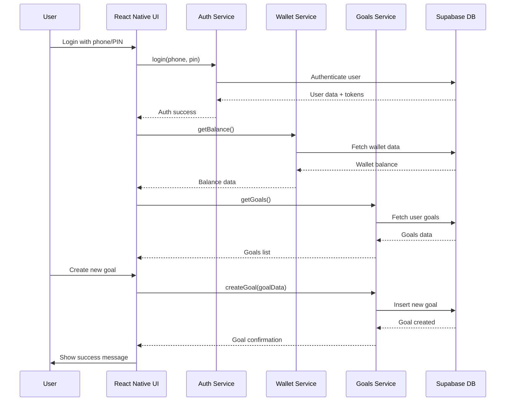

# Components

## Auth Service

**Responsibility:** User authentication and session management

**Key Interfaces:**
- `register(phoneNumber: string, pin: string, userData: RegisterData): Promise<AuthResponse>`
- `login(phoneNumber: string, pin: string): Promise<AuthResponse>`
- `logout(): Promise<void>`
- `refreshToken(): Promise<AuthResponse>`
- `verifyPin(pin: string): Promise<boolean>`

**Dependencies:**
- Supabase Auth
- Secure storage for tokens
- PIN validation service

**Technology Stack:**
- Supabase Auth client
- React Native Secure Storage
- Biometric authentication (optional)

## Wallet Service

**Responsibility:** Wallet balance management and transaction processing

**Key Interfaces:**
- `getBalance(): Promise<Wallet>`
- `getTransactions(filters?: TransactionFilters): Promise<Transaction[]>`
- `deposit(amount: number, method: PaymentMethod): Promise<Transaction>`
- `withdraw(amount: number, method: PaymentMethod): Promise<Transaction>`

**Dependencies:**
- Supabase Database (wallets, transactions tables)
- Transaction processing service
- Payment gateway integration

**Technology Stack:**
- Supabase Database client
- Transaction queue processor
- Redis for balance caching

## Goals Service

**Responsibility:** Savings goals management and progress tracking

**Key Interfaces:**
- `createGoal(goalData: CreateGoalData): Promise<SavingsGoal>`
- `updateGoal(goalId: string, updates: UpdateGoalData): Promise<SavingsGoal>`
- `deleteGoal(goalId: string): Promise<void>`
- `fundGoal(goalId: string, amount: number): Promise<Transaction>`
- `getGoals(filters?: GoalFilters): Promise<SavingsGoal[]>`

**Dependencies:**
- Supabase Database (savings_goals table)
- Wallet service for balance checks
- Transaction service for recording allocations

**Technology Stack:**
- Supabase Database client
- Goal calculation engine
- Progress tracking algorithms

## M-PESA Service

**Responsibility:** M-PESA integration and round-up processing

**Key Interfaces:**
- `linkAccount(phoneNumber: string): Promise<MpesaAccount>`
- `updateAccountSettings(accountId: string, settings: MpesaSettings): Promise<MpesaAccount>`
- `processRoundUp(transaction: MpesaTransaction): Promise<Transaction>`
- `initiateStkPush(phoneNumber: string, amount: number): Promise<StkResponse>`

**Dependencies:**
- M-PESA Daraja API
- Transaction processing service
- Webhook handler for transaction notifications

**Technology Stack:**
- Supabase Edge Functions
- M-PESA Daraja API client
- Webhook processing

## Analytics Service

**Responsibility:** Savings analytics and reporting

**Key Interfaces:**
- `getSavingsAnalytics(period: AnalyticsPeriod): Promise<SavingsAnalytics>`
- `getGoalProgress(goalId: string): Promise<GoalProgress>`
- `getUserSummary(userId: string): Promise<UserSummary>`

**Dependencies:**
- Supabase Database (transactions, goals tables)
- Data aggregation service
- Chart generation utilities

**Technology Stack:**
- Supabase Database client
- Data aggregation queries
- Chart.js for visualization

## Notification Service

**Responsibility:** In-app notifications and alerts

**Key Interfaces:**
- `sendNotification(userId: string, notification: Notification): Promise<void>`
- `markAsRead(notificationId: string): Promise<void>`
- `getNotifications(userId: string): Promise<Notification[]>`

**Dependencies:**
- Supabase Realtime
- Push notification service
- Local notification storage

**Technology Stack:**
- Supabase Realtime
- React Native Push Notifications
- Local storage

## Component Diagrams

```mermaid
graph TB
    subgraph "Frontend Components"
        A[Auth Screens]
        B[Dashboard Screen]
        C[Goals Screen]
        D[Transactions Screen]
        E[Settings Screen]
        F[Navigation Components]
        G[UI Components Library]
    end

    subgraph "Service Layer"
        H[Auth Service]
        I[Wallet Service]
        J[Goals Service]
        K[M-PESA Service]
        L[Analytics Service]
        M[Notification Service]
    end

    subgraph "Data Layer"
        N[Supabase Client]
        O[Local Storage]
        P[Cache Layer]
    end

    subgraph "External Services"
        Q[M-PESA API]
        R[Push Notification Service]
    end

    A --> H
    B --> I
    B --> L
    C --> J
    C --> L
    D --> I
    D --> M
    E --> H
    E --> K
    F --> G

    H --> N
    I --> N
    J --> N
    K --> N
    L --> N
    M --> N

    H --> O
    I --> P
    J --> P

    K --> Q
    M --> R

    style A fill:#e3f2fd
    style B fill:#e3f2fd
    style C fill:#e3f2fd
    style D fill:#e3f2fd
    style E fill:#e3f2fd
    style F fill:#e3f2fd
    style G fill:#e3f2fd
    style H fill:#f3e5f5
    style I fill:#f3e5f5
    style J fill:#f3e5f5
    style K fill:#f3e5f5
    style L fill:#f3e5f5
    style M fill:#f3e5f5
    style N fill:#e8f5e8
    style O fill:#e8f5e8
    style P fill:#e8f5e8
    style Q fill:#fff3e0
    style R fill:#fff3e0
```

## Component Interactions

