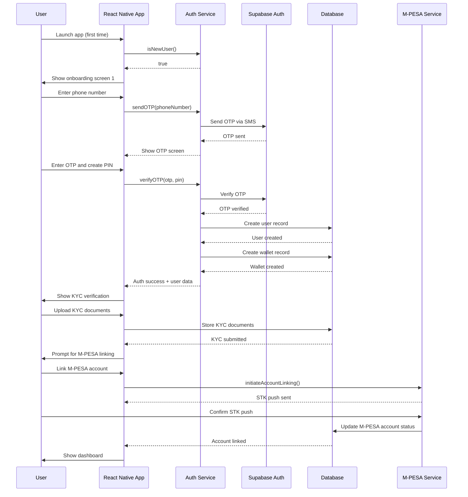
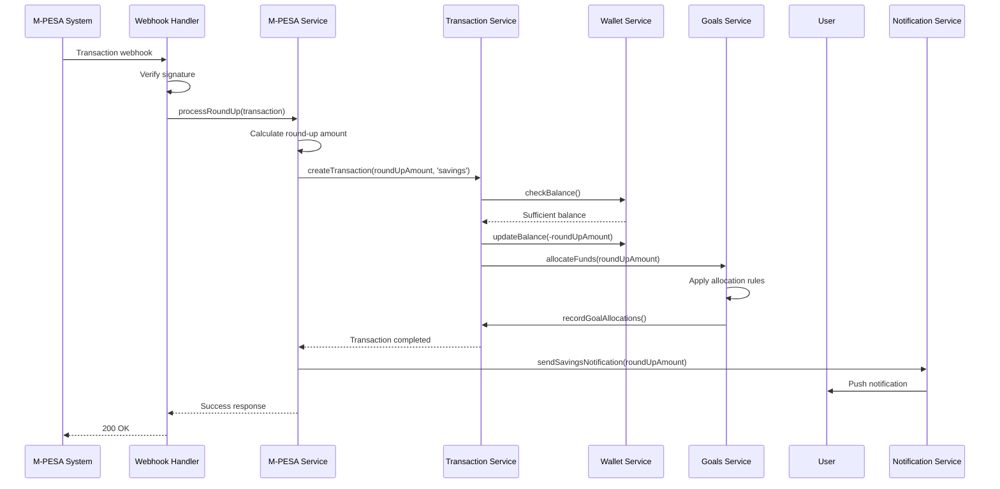
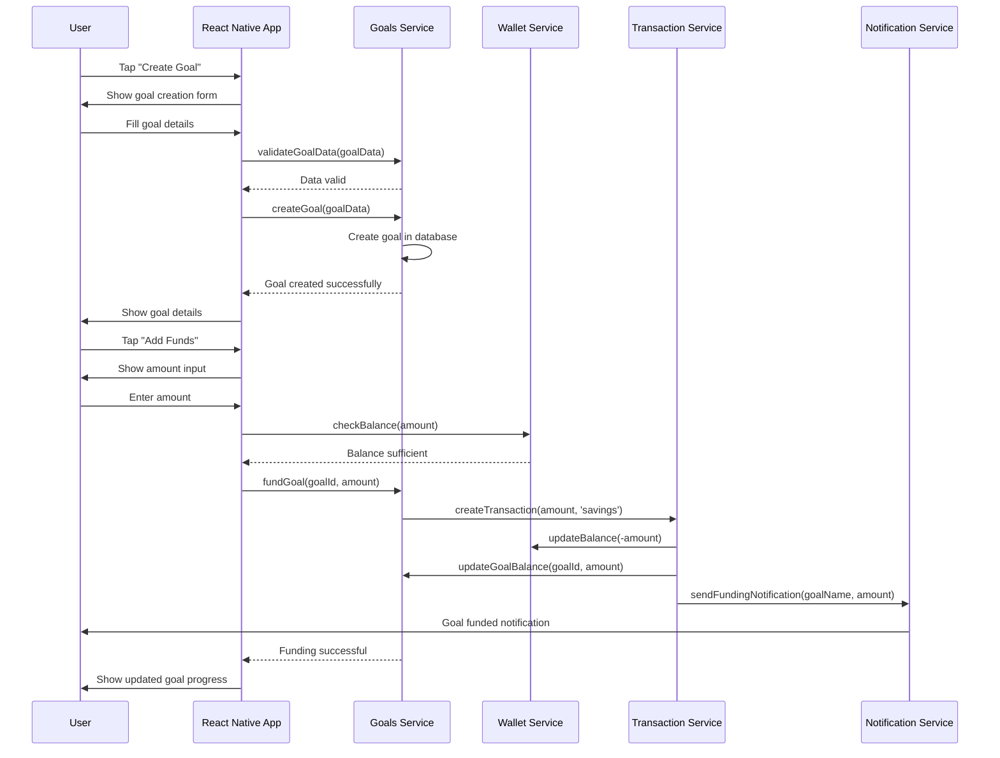

# Core Workflows

## User Onboarding Flow

```mermaid
sequenceDiagram
    participant U as User
    participant UI as React Native App
    participant Auth as Auth Service
    participant Supabase as Supabase Auth
    participant DB as Database
    participant MPESA as M-PESA Service

    U->>UI: Launch app (first time)
    UI->>Auth: isNewUser()
    Auth-->>UI: true
    UI->>U: Show onboarding screen 1
    U->>UI: Enter phone number
    UI->>Auth: sendOTP(phoneNumber)
    Auth->>Supabase: Send OTP via SMS
    Supabase-->>Auth: OTP sent
    Auth-->>UI: Show OTP screen
    U->>UI: Enter OTP and create PIN
    UI->>Auth: verifyOTP(otp, pin)
    Auth->>Supabase: Verify OTP
    Supabase-->>Auth: OTP verified
    Auth->>DB: Create user record
    DB-->>Auth: User created
    Auth->>DB: Create wallet record
    DB-->>Auth: Wallet created
    Auth-->>UI: Auth success + user data
    UI->>U: Show KYC verification
    U->>UI: Upload KYC documents
    UI->>DB: Store KYC documents
    DB-->>UI: KYC submitted
    UI->>U: Prompt for M-PESA linking
    U->>UI: Link M-PESA account
    UI->>MPESA: initiateAccountLinking()
    MPESA-->>UI: STK push sent
    U->>MPESA: Confirm STK push
    MPESA->>DB: Update M-PESA account status
    DB-->>UI: Account linked
    UI->>U: Show dashboard
```

## M-PESA Round-Up Savings Flow

```mermaid
sequenceDiagram
    participant M as M-PESA System
    participant WH as Webhook Handler
    participant MP as M-PESA Service
    participant TX as Transaction Service
    participant WAL as Wallet Service
    participant GOAL as Goals Service
    participant U as User
    participant NOTIF as Notification Service

    M->>WH: Transaction webhook
    WH->>WH: Verify signature
    WH->>MP: processRoundUp(transaction)
    MP->>MP: Calculate round-up amount
    MP->>TX: createTransaction(roundUpAmount, 'savings')
    TX->>WAL: checkBalance()
    WAL-->>TX: Sufficient balance
    TX->>WAL: updateBalance(-roundUpAmount)
    TX->>GOAL: allocateFunds(roundUpAmount)
    GOAL->>GOAL: Apply allocation rules
    GOAL->>TX: recordGoalAllocations()
    TX-->>MP: Transaction completed
    MP->>NOTIF: sendSavingsNotification(roundUpAmount)
    NOTIF->>U: Push notification
    MP-->>WH: Success response
    WH-->>M: 200 OK
```

## Goal Creation and Funding Flow

```mermaid
sequenceDiagram
    participant U as User
    participant UI as React Native App
    participant GOAL as Goals Service
    participant WAL as Wallet Service
    participant TX as Transaction Service
    participant NOTIF as Notification Service

    U->>UI: Tap "Create Goal"
    UI->>U: Show goal creation form
    U->>UI: Fill goal details
    UI->>GOAL: validateGoalData(goalData)
    GOAL-->>UI: Data valid
    UI->>GOAL: createGoal(goalData)
    GOAL->>GOAL: Create goal in database
    GOAL-->>UI: Goal created successfully
    UI->>U: Show goal details
    U->>UI: Tap "Add Funds"
    UI->>U: Show amount input
    U->>UI: Enter amount
    UI->>WAL: checkBalance(amount)
    WAL-->>UI: Balance sufficient
    UI->>GOAL: fundGoal(goalId, amount)
    GOAL->>TX: createTransaction(amount, 'savings')
    TX->>WAL: updateBalance(-amount)
    TX->>GOAL: updateGoalBalance(goalId, amount)
    TX->>NOTIF: sendFundingNotification(goalName, amount)
    NOTIF->>U: Goal funded notification
    GOAL-->>UI: Funding successful
    UI->>U: Show updated goal progress
```
