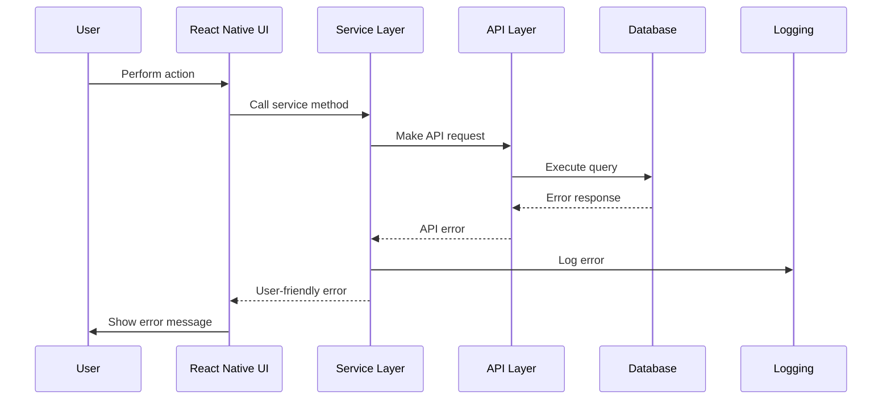

# Error Handling Strategy

## Error Flow



## Error Response Format

```typescript
interface ApiError {
  error: {
    code: string;
    message: string;
    details?: Record<string, any>;
    timestamp: string;
    requestId: string;
  };
}
```

## Frontend Error Handling

```typescript
// apps/mobile/src/services/utils/errorHandling.ts
import { Alert } from 'react-native';

export class AppError extends Error {
  constructor(
    message: string,
    public code: string,
    public details?: Record<string, any>
  ) {
    super(message);
    this.name = 'AppError';
  }
}

export const handleApiError = (error: any) => {
  console.error('API Error:', error);

  if (error.response?.data?.error) {
    const { code, message } = error.response.data.error;

    switch (code) {
      case 'INVALID_CREDENTIALS':
        Alert.alert('Login Failed', 'Invalid phone number or PIN');
        break;
      case 'INSUFFICIENT_FUNDS':
        Alert.alert('Insufficient Funds', 'You do not have enough balance for this transaction');
        break;
      case 'NETWORK_ERROR':
        Alert.alert('Network Error', 'Please check your internet connection and try again');
        break;
      default:
        Alert.alert('Error', message || 'An unexpected error occurred');
    }
  } else {
    Alert.alert('Error', 'An unexpected error occurred. Please try again.');
  }
};
```

## Backend Error Handling

```typescript
// supabase/functions/_shared/errors.ts
export class ValidationError extends Error {
  constructor(message: string, public field?: string) {
    super(message);
    this.name = 'ValidationError';
  }
}

export class BusinessError extends Error {
  constructor(message: string, public code: string) {
    super(message);
    this.name = 'BusinessError';
  }
}

export const createErrorResponse = (error: Error, requestId: string) => {
  if (error instanceof ValidationError) {
    return {
      error: {
        code: 'VALIDATION_ERROR',
        message: error.message,
        details: error.field ? { field: error.field } : undefined,
        timestamp: new Date().toISOString(),
        requestId,
      },
    };
  }

  if (error instanceof BusinessError) {
    return {
      error: {
        code: error.code,
        message: error.message,
        timestamp: new Date().toISOString(),
        requestId,
      },
    };
  }

  return {
    error: {
      code: 'INTERNAL_ERROR',
      message: 'An unexpected error occurred',
      timestamp: new Date().toISOString(),
      requestId,
    },
  };
};
```
