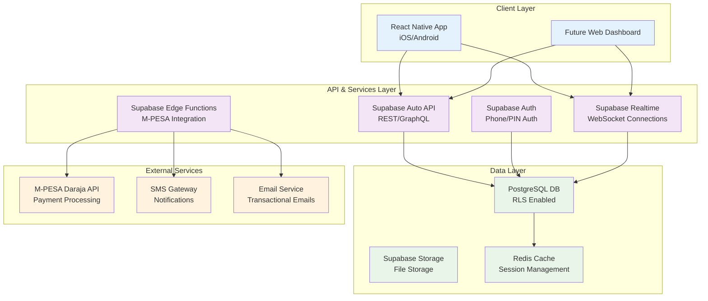

# High Level Architecture

## Technical Summary

Zanari will implement a serverless architecture using Supabase as the primary Backend-as-a-Service platform, combined with a React Native mobile application. The system leverages automated savings through M-PESA integration, providing users with a seamless experience for building financial resilience. The architecture prioritizes scalability, security, and compliance with Kenyan data protection regulations while maintaining a rapid development cycle for the MVP.

## Platform and Infrastructure Choice

**Platform:** Supabase Cloud (with migration plan to Kenyan cloud provider)

**Key Services:**
- **Database:** Supabase PostgreSQL with Row Level Security (RLS)
- **Authentication:** Supabase Auth with phone number and PIN verification
- **API Layer:** Supabase Auto-generated REST API + Edge Functions
- **Storage:** Supabase Storage for user documents and assets
- **Real-time:** Supabase Real-time for instant balance updates
- **Functions:** Supabase Edge Functions for M-PESA integration and complex business logic

**Deployment Host and Regions:**
- **Initial:** Supabase Cloud (US/EU regions)
- **Post-MVP:** Self-hosted Supabase on Kenyan cloud provider (AWS Africa, Azure South Africa)

**Rationale:** Supabase provides a complete BaaS solution that accelerates development while maintaining scalability. The serverless approach reduces operational overhead and allows focus on business logic rather than infrastructure management.

## Repository Structure

**Structure:** Monorepo with Nx or Turborepo

**Monorepo Tool:** Nx (preferred) or Turborepo

**Package Organization:**
```
zanari/
├── apps/
│   ├── mobile/              # React Native app
│   └── web/                 # Future web dashboard
├── packages/
│   ├── shared/              # Shared TypeScript types and utilities
│   ├── ui/                  # Shared UI components
│   ├── data/               # Data models and validation schemas
│   └── config/             # Shared configuration
├── supabase/               # Database migrations and edge functions
├── docs/                   # Documentation
└── infrastructure/         # IaC for future self-hosting
```

**Rationale:** Monorepo enables code sharing between mobile and future web applications, consistent TypeScript types across the stack, and unified development tooling.

## High Level Architecture Diagram



## Architectural Patterns

- **Jamstack Architecture:** Static mobile app with serverless APIs - *Rationale:* Optimal performance and security for financial applications*
- **Component-Based UI:** Reusable React Native components with TypeScript - *Rationale:* Maintainability and type safety across large codebases*
- **Repository Pattern:** Abstract data access logic through service layer - *Rationale:* Enables testing and future database migration flexibility*
- **API Gateway Pattern:** Supabase as single entry point for all data operations - *Rationale:* Centralized auth, rate limiting, and monitoring*
- **Event-Driven Architecture:** Webhook-based transaction processing - *Rationale:* Real-time processing of M-PESA transactions*
- **CQRS Pattern:** Separate read and write operations for complex queries - *Rationale:* Optimized performance for analytics and reporting*
- **Microfrontend Architecture:** Independent mobile and web apps - *Rationale:* Platform-specific optimization while sharing business logic*
