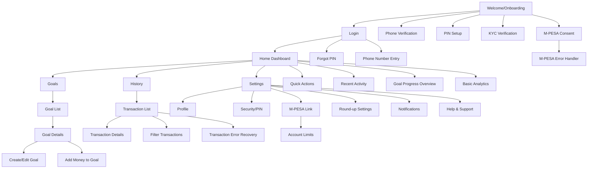
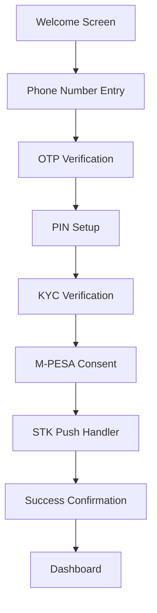
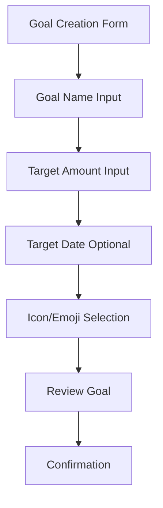
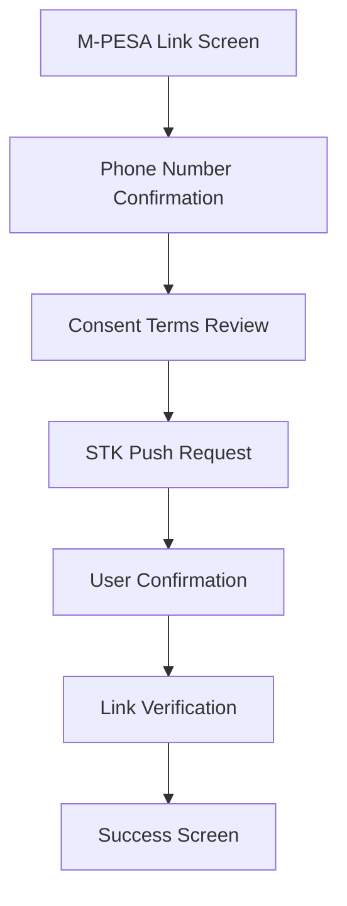
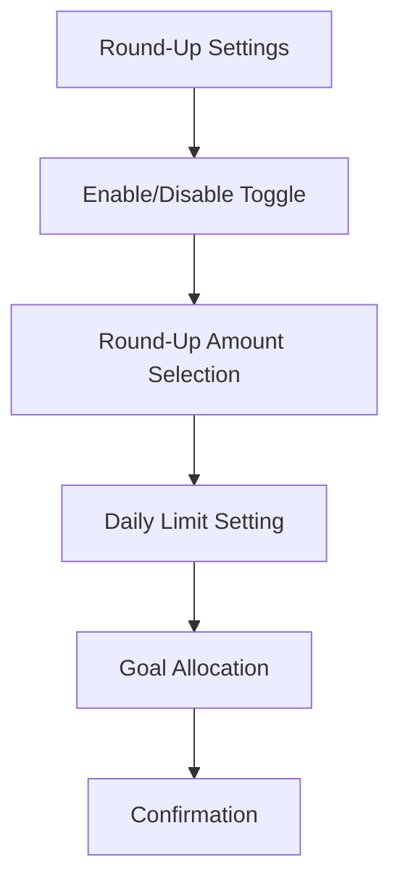
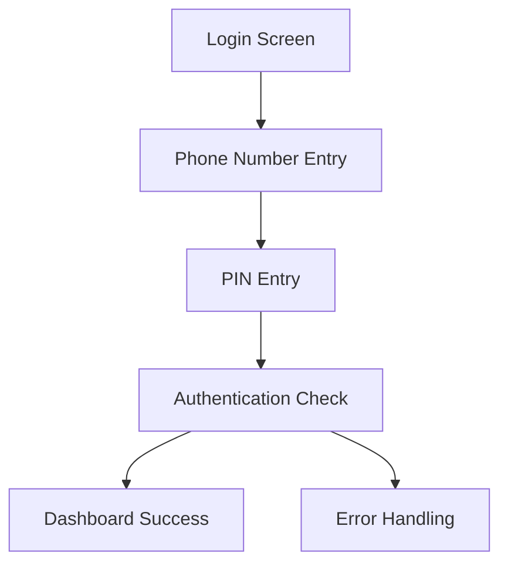
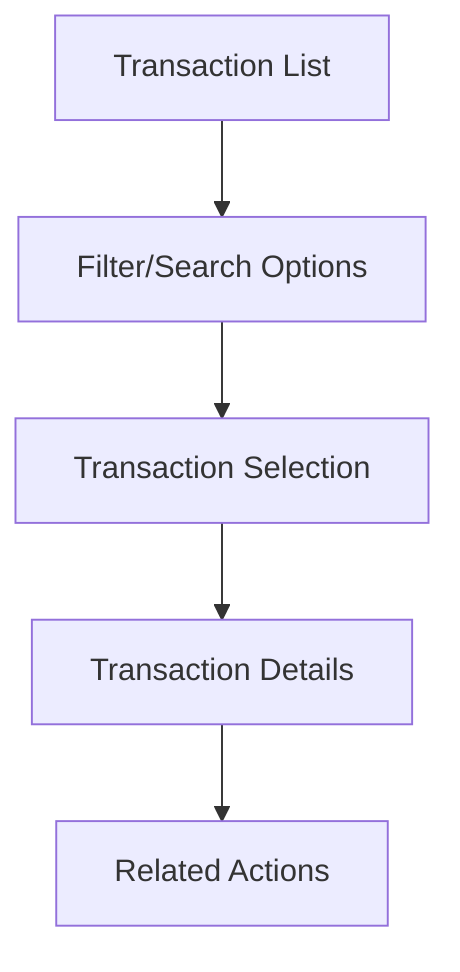
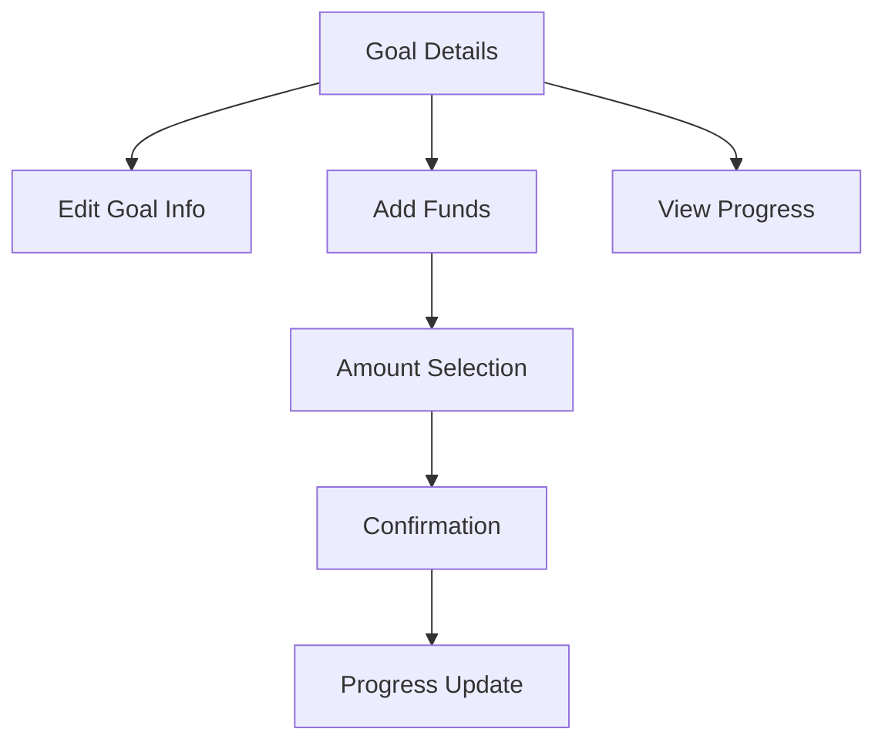
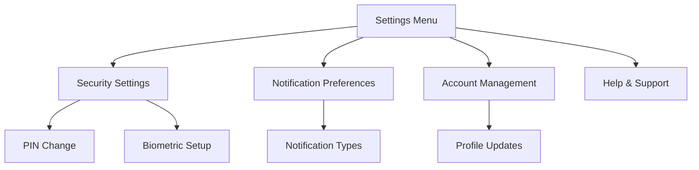

# Zanari UI/UX Specification

## Introduction

This document defines the user experience goals, information architecture, user flows, and visual design specifications for Zanari's user interface. It serves as the foundation for visual design and frontend development, ensuring a cohesive and user-centered experience.

### Overall UX Goals & Principles

#### Target User Personas

**Primary User: Tech-Savvy Saver**
- Kenyan mobile money users aged 25-45
- Comfortable with M-PESA and mobile apps
- Seeking automated savings solutions
- Values convenience and financial security
- Has irregular income patterns

**Secondary User: Savings Motivator**
- Users who struggle with manual savings discipline
- Need visual progress tracking and encouragement
- Prefer simple, guided interfaces
- May be less tech-savvy but willing to learn for financial benefit

**Administrator: System Manager**
- Technical staff managing the platform
- Need oversight and control capabilities
- Focus on security and compliance

#### Usability Goals

- **Ease of learning:** New users can complete core tasks within 5 minutes
- **Efficiency of use:** Power users can complete frequent tasks with minimal clicks
- **Error prevention:** Clear validation and confirmation for destructive actions
- **Memorability:** Infrequent users can return without relearning
- **Trust building:** Security features are visible but not intrusive

#### Design Principles

1. **Clarity over cleverness** - Prioritize clear communication over aesthetic innovation
2. **Progressive disclosure** - Show only what's needed, when it's needed
3. **Consistent patterns** - Use familiar UI patterns throughout the application
4. **Immediate feedback** - Every action should have a clear, immediate response
5. **Accessible by default** - Design for all users from the start

### Change Log

| Date | Version | Description | Author |
|------|---------|-------------|---------|
| 2025-09-17 | 1.0 | Initial front-end specification draft | Sally (UX Expert) |

## Information Architecture (IA)

### Site Map / Screen Inventory



### Navigation Structure

**Primary Navigation:** Bottom tab bar with 3 main sections: Home (combined dashboard/analytics), Goals, History. Settings accessible via slide-out menu.

**Secondary Navigation:** Breadcrumb trail for nested screens (e.g., Goals → Goal Name → Edit Goal). Floating action button for primary actions.

**Breadcrumb Strategy:** Simple back navigation with contextual titles. No traditional breadcrumbs due to mobile-first design, instead using clear screen titles and back buttons.

### Screen Details and Technical Considerations

**Core Screens:**
- **Home Dashboard:** Real-time balance display, recent transactions summary, goal progress overview, basic analytics
- **Goals:** Visual goal cards with progress bars, quick actions for adding funds
- **History:** Filterable transaction list with search and categorization

**Technical IA Considerations:**
- **State Management:** Each screen maintains independent state for offline capability
- **Data Fetching:** Dashboard loads first, other screens lazy-load on navigation
- **Caching Strategy:** Transaction history cached locally, goal data synced in real-time
- **Deep Linking:** Support for direct navigation to specific goals or transactions

**User Flow Patterns:**
- **Linear Flows:** Onboarding, goal creation, M-PESA linking follow step-by-step progression
- **Hub-and-Spoke:** Dashboard serves as central hub with spokes to features
- **Tab-based Navigation:** Quick switching between primary activities without losing context

## User Flows

### New User Onboarding Flow

**User Goal:** Complete account setup and link M-PESA account to start automated savings

**Entry Points:** App download and first launch

**Success Criteria:** User can view dashboard and has M-PESA account linked for round-up savings

#### Flow Diagram



#### Edge Cases & Error Handling:
- Invalid phone number format
- OTP delivery failure
- Network timeout during PIN setup
- KYC document upload issues
- M-PESA STK push timeout
- User cancels M-PESA authorization

#### Notes:
Onboarding must be completed in a single session. Progress is saved after each successful step to allow resumption if interrupted.

### Goal Creation Flow

**User Goal:** Create a new savings goal with target amount and timeline

**Entry Points:** Dashboard "Create Goal" button, Goals screen floating action button

**Success Criteria:** Goal is saved and visible in goal list with progress tracking

#### Flow Diagram



#### Edge Cases & Error Handling:
- Invalid amount format
- Target date in the past
- Duplicate goal name
- Insufficient funds for initial allocation

#### Notes:
User can set up goals before or after linking M-PESA. Goals without M-PESA link show "Connect M-PESA to start saving" message.

### M-PESA Linking Flow

**User Goal:** Connect M-PESA account for automated round-up savings

**Entry Points:** Settings menu, Dashboard prompt, Goal creation flow

**Success Criteria:** M-PESA account linked and ready for round-up transactions

#### Flow Diagram



#### Edge Cases & Error Handling:
- Wrong phone number format
- STK push not received
- User declines STK push
- Network timeout during verification
- M-PESA service unavailable

#### Notes:
This flow can be initiated from multiple contexts. Must handle re-authentication if link expires.

### Round-Up Savings Flow

**User Goal:** Configure and monitor automated savings from M-PESA transactions

**Entry Points:** Settings menu, Dashboard prompt, Onboarding completion

**Success Criteria:** User has round-up preferences set and receives notifications for savings

#### Flow Diagram



#### Edge Cases & Error Handling:
- Invalid limit amounts
- No goals available for allocation
- Insufficient wallet balance for manual setup
- Settings save failure

#### Notes:
This flow covers user preferences for round-up savings. The actual backend processing is handled separately and triggers user notifications.

### Authentication Flow

**User Goal:** Securely access account using phone number and PIN

**Entry Points:** App launch, session timeout, manual logout

**Success Criteria:** User is authenticated and can access account features

#### Flow Diagram



#### Edge Cases & Error Handling:
- Invalid phone number format
- Wrong PIN entry (multiple attempts)
- Account locked due to too many attempts
- Network timeout during authentication
- Account not found

#### Notes:
Failed login attempts should be tracked. After 3 failed attempts, implement progressive delay. After 5 attempts, temporarily lock account.

### Transaction History Flow

**User Goal:** View and understand transaction history and savings activity

**Entry Points:** History tab, Dashboard transaction summary, Goal transaction links

**Success Criteria:** User can locate specific transactions and understand their savings patterns

#### Flow Diagram



#### Edge Cases & Error Handling:
- No transactions available (empty state)
- Large dataset pagination
- Search/filter application errors
- Transaction details loading failure

#### Notes:
Include visual indicators for transaction types (deposits, savings, fees). Show running totals and savings impact.

### Goal Management Flow

**User Goal:** Edit existing goals, add funds, or track progress

**Entry Points:** Goal details screen, Dashboard goal cards, Goals list

**Success Criteria:** User can modify goals and see updated progress immediately

#### Flow Diagram



#### Edge Cases & Error Handling:
- Goal completion celebration
- Insufficient funds for allocation
- Goal deadline passed
- Multiple goal funding conflicts

#### Notes:
Provide clear feedback when goals are completed. Allow users to archive or delete completed goals.

### Settings Management Flow

**User Goal:** Configure app preferences, security settings, and account options

**Entry Points:** Settings menu, Profile icon, contextual settings links

**Success Criteria:** User can successfully modify preferences and see changes applied

#### Flow Diagram



#### Edge Cases & Error Handling:
- Settings save failures
- Authentication required for sensitive changes
- Conflicting preference settings
- Network issues during updates

#### Notes:
Group related settings logically. Provide clear feedback when changes are applied. Require re-authentication for security settings.

## Wireframes & Mockups

### Primary Design Files

**Primary Design Files:** Figma design system to be created. Wireframes and high-fidelity mockups will be developed in Figma with interactive prototypes for user testing.

### Key Screen Layouts

#### Home Dashboard Screen

**Purpose:** Provide at-a-glance view of financial status and quick actions

**Key Elements:**
- Wallet balance display (prominent, top of screen)
- Recent transactions list (3-5 most recent)
- Goal progress overview cards
- Quick action buttons (Add Money, Create Goal)
- Basic savings chart (weekly/monthly trend)
- Floating action button for primary actions

**Interaction Notes:**
- Balance updates in real-time when app comes to foreground
- Transaction items are tappable for details
- Goal cards show progress bars and quick actions
- Chart is interactive with touch gestures

**Design File Reference:** Figma frame: "01-Home-Dashboard"

#### Goals Screen

**Purpose:** List and manage savings goals

**Key Elements:**
- Goal cards in scrollable list
- Each card shows: name, progress %, target amount, timeline
- Visual progress indicators (progress bars, circular progress)
- Create goal floating action button
- Filter/sort options
- Empty state illustration when no goals

**Interaction Notes:**
- Cards expand to show goal details and actions
- Long press for quick actions (edit, delete, archive)
- Pull-to-refresh for updated goal progress
- Swipe gestures for goal management

**Design File Reference:** Figma frame: "02-Goals-List"

#### Transaction History Screen

**Purpose:** View and analyze transaction activity

**Key Elements:**
- Transaction list with date headers
- Transaction type indicators (icons/colors)
- Search bar at top
- Filter options (type, date range, amount)
- Running balance display
- Export functionality

**Interaction Notes:**
- Infinite scroll with pagination
- Pull-to-refresh for latest transactions
- Tap transaction for detailed view
- Advanced filters in overlay modal
- Search-as-you-type functionality

**Design File Reference:** Figma frame: "03-Transaction-History"

#### Onboarding Screens

**Purpose:** Guide new users through account setup

**Key Elements:**
- Welcome screen with value proposition
- Phone number entry with country code
- PIN setup with confirmation
- KYC document upload interface
- M-PESA consent and linking
- Progress indicator for multi-step flow

**Interaction Notes:**
- Step-by-step wizard with back navigation
- Auto-advance after successful steps
- Save progress after each completed step
- Inline validation for all inputs
- Loading states for external processes

**Design File Reference:** Figma frame: "04-Onboarding-Flow"

#### Goal Creation Screen

**Purpose:** Create new savings goals

**Key Elements:**
- Goal name input field
- Target amount with numeric keypad
- Optional target date picker
- Icon/emoji selector
- Goal allocation options
- Preview of goal card
- Create/Cancel actions

**Interaction Notes:**
- Real-time validation of inputs
- Amount suggestions based on user history
- Date picker with minimum date validation
- Icon preview selection
- Goal allocation preview with percentages

**Design File Reference:** Figma frame: "05-Goal-Creation"

#### Settings Screen

**Purpose:** Manage app preferences and account settings

**Key Elements:**
- User profile section
- Settings categories with icons
- Security settings (PIN, biometrics)
- Notification preferences
- M-PESA account management
- Help and support options
- About section

**Interaction Notes:**
- Expandable/collapsible sections
- Toggle switches for preferences
- Authentication required for sensitive settings
- Clear visual feedback for changes
- External links handled appropriately

**Design File Reference:** Figma frame: "06-Settings"

### Interactive Elements

#### Navigation
- Bottom tab bar with 3 main sections
- Slide-out menu for settings
- Breadcrumb navigation for nested screens
- Back buttons with contextual titles

#### Form Inputs
- Phone number with country code picker
- PIN entry with masked input
- Amount inputs with currency formatting
- Date pickers with calendar view
- Toggle switches for preferences

#### Feedback Mechanisms
- Loading spinners for async operations
- Success animations for completed actions
- Error toasts for validation issues
- Haptic feedback for key interactions
- Progress indicators for multi-step flows

## Component Library / Design System

### Design System Approach

**Design System Approach:** Build a custom design system using React Native components with TypeScript. Create a foundational set of reusable components that maintain consistency across the app while allowing for customization as needed. The system will be documented in Storybook for component development and testing.

**Technical Strategy:**
- Use React Native Paper as base component library for consistent styling
- Create custom components on top of base library for Zanari-specific needs
- Implement TypeScript interfaces for all component props
- Use React Hook Form with Yup validation for form components
- Implement proper accessibility with React Native Accessibility APIs

### Core Components

#### Theme & Typography System

**Purpose:** Foundational theming and typography for consistent visual design

**Variants:**
- Light mode (primary)
- Dark mode (future)
- High contrast mode (accessibility)

**Core Design Tokens:**
- Colors: Primary (#2E7D32), Secondary (#1976D2), Success (#4CAF50), Warning (#FF9800), Error (#F44336)
- Typography: Inter font family with defined scale (12px - 32px)
- Spacing: 8px base unit with multiples (4px, 8px, 16px, 24px, 32px)
- Border radius: Small (4px), Medium (8px), Large (16px)
- Elevation: 0-24dp for shadows and depth

**Usage Guidelines:**
- Implement with React Native Paper theming system
- Define custom theme in theme.ts with TypeScript interfaces
- Use MD3 design system as foundation
- Ensure WCAG AA contrast ratios for all color combinations

#### Button Component

**Purpose:** Standard button for primary and secondary actions

**TypeScript Interface:**
```typescript
interface ButtonProps {
  variant: 'primary' | 'secondary' | 'tertiary' | 'fab' | 'destructive';
  size: 'small' | 'medium' | 'large';
  loading?: boolean;
  disabled?: boolean;
  icon?: React.ReactNode;
  onPress: () => void;
  children: React.ReactNode;
}
```

**Variants:**
- Primary (filled, brand color)
- Secondary (outlined)
- Tertiary (text only)
- Floating Action Button
- Destructive (red for dangerous actions)

**States:**
- Default (enabled, not pressed)
- Pressed (visual feedback)
- Disabled (reduced opacity)
- Loading (spinner, disabled state)
- Success (checkmark, disabled state)

**Accessibility:**
- Minimum touch target: 44x44 points
- Proper accessibilityLabel for screen readers
- Accessibility state announcements
- Haptic feedback on press

**Performance:**
- Use React.memo for optimization
- Prevent double-taps with debounce
- Avoid inline functions in onPress

**Usage Guidelines:**
- Primary buttons for main actions
- Secondary for secondary actions
- Use loading state for async operations
- Include appropriate icons for visual clarity

#### Card Component

**Purpose:** Container for content sections with consistent styling

**Variants:**
- Elevation (different shadow levels)
- Rounded corners
- Bordered
- Transparent

**States:**
- Default
- Pressed
- Selected
- Disabled

**Usage Guidelines:**
- Use for goal cards, transaction items, setting sections
- Consistent padding and margins
- Include touch targets (minimum 44x44 points)
- Support for swipe actions on list items

#### Input Component

**Purpose:** Form input with validation and error handling

**Variants:**
- Text input
- Numeric input
- Phone number (with country code)
- PIN input (masked)
- Amount input (with currency formatting)
- Text area
- Search input

**States:**
- Empty
- Filled
- Focused
- Error
- Disabled
- Success

**Usage Guidelines:**
- Always include labels
- Provide inline validation
- Show helper text when appropriate
- Use appropriate keyboard types
- Implement secure text entry for sensitive data

#### Progress Component

**Purpose:** Visual representation of progress and completion

**Variants:**
- Linear progress bar
- Circular progress
- Step indicator
- Skeleton loader

**States:**
- 0-100% progress
- Indeterminate loading
- Success completed
- Error state

**Usage Guidelines:**
- Use for goal progress, onboarding steps, file uploads
- Include percentage labels when helpful
- Use indeterminate for unknown duration
- Show success state upon completion

#### Navigation Components

**Purpose:** Navigation and routing elements

**Variants:**
- Bottom tab bar
- Header with back button
- Slide-out menu items
- Breadcrumb navigation
- Tab controller

**States:**
- Active/inactive tabs
- Navigation stack depth
- Menu open/closed
- Back button visibility

**Usage Guidelines:**
- Limit bottom tabs to 3-5 items
- Use clear, concise labels
- Include icons for quick recognition
- Maintain consistent navigation patterns

#### Modal Component

**Purpose:** Overlay dialogs for focused interactions

**Variants:**
- Alert dialog
- Confirmation dialog
- Form modal
- Bottom sheet
- Full screen modal

**States:**
- Open/closed
- Loading
- Success
- Error

**Usage Guidelines:**
- Use for destructive actions, confirmations, complex forms
- Include clear cancel/confirm actions
- Dismissible on outside tap (unless critical)
- Proper z-index layering

#### List Component

**Purpose:** Display scrollable lists of items

**Variants:**
- Flat list
- Section list (with headers)
- Infinite scroll
- Searchable list
- Selectable list

**States:**
- Empty
- Loading
- Populated
- End reached
- Error

**Usage Guidelines:**
- Include pull-to-refresh functionality
- Show loading indicators
- Handle empty states gracefully
- Implement proper performance optimization

#### Chart Component

**Purpose:** Data visualization for savings analytics

**Variants:**
- Line chart (trends over time)
- Bar chart (comparisons)
- Pie chart (allocations)
- Progress chart (goal completion)

**States:**
- Loading
- Populated with data
- No data
- Error

**Usage Guidelines:**
- Use for savings trends, goal progress, category breakdowns
- Include interactive tooltips
- Provide clear axis labels
- Ensure accessibility with proper labels

#### Notification Component

**Purpose:** In-app notifications and alerts

**Variants:**
- Toast notification
- Banner notification
- Push notification preview
- Badge indicator

**States:**
- Info
- Success
- Warning
- Error

**Usage Guidelines:**
- Use for transaction confirmations, errors, updates
- Auto-dismiss after appropriate time
- Include clear action buttons when needed
- Stack multiple notifications appropriately

#### Avatar Component

**Purpose:** User profile image or initials display

**TypeScript Interface:**
```typescript
interface AvatarProps {
  size: 'small' | 'medium' | 'large';
  source?: string; // Image URI
  name?: string; // For initials fallback
  online?: boolean;
  onPress?: () => void;
}
```

**Variants:**
- Image avatar
- Initials fallback
- Online status indicator
- Clickable profile link

**Accessibility:**
- accessibilityLabel with user name
- Proper image accessibility roles
- Touch feedback for interactions

#### Currency Display Component

**Purpose:** Formatted currency display for financial data

**TypeScript Interface:**
```typescript
interface CurrencyProps {
  amount: number;
  currency: 'KES' | 'USD';
  variant: 'standard' | 'compact' | 'large';
  showSymbol?: boolean;
  color?: 'default' | 'positive' | 'negative';
}
```

**Features:**
- Proper KES formatting (KES 1,234.56)
- Locale-aware number formatting
- Color coding for positive/negative amounts
- Compact mode for space-constrained areas

#### Skeleton Loader Component

**Purpose:** Loading state placeholders for better perceived performance

**TypeScript Interface:**
```typescript
interface SkeletonProps {
  variant: 'text' | 'avatar' | 'card' | 'list';
  lines?: number;
  width?: number | string;
  height?: number;
}
```

**Variants:**
- Text lines (for loading content)
- Avatar placeholder
- Card skeleton
- List item skeleton

**Accessibility:**
- accessibilityRole="progressbar"
- Accessibility label indicating loading state
- Screen reader announcements

## Branding & Style Guide

### Visual Identity

**Brand Guidelines:** To be developed by brand team. Current direction focuses on trust, growth, and accessibility. Visual identity should evoke security, modernity, and optimism for a Kenyan financial audience.

### Color Palette

| Color Type | Hex Code | Usage |
|------------|----------|-------|
| Primary | #2E7D32 | Primary buttons, active states, important accents |
| Primary Light | #4CAF50 | Success states, positive indicators |
| Primary Dark | #1B5E20 | Headers, important text |
| Secondary | #1976D2 | Secondary buttons, links, informational elements |
| Secondary Light | #42A5F5 | Backgrounds, subtle highlights |
| Secondary Dark | #0D47A1 | Emphasized secondary elements |
| Accent | #FF9800 | Calls to action, warnings, important notices |
| Success | #4CAF50 | Positive feedback, confirmations, completed states |
| Warning | #FF9800 | Cautions, important notices, pending states |
| Error | #F44336 | Errors, destructive actions, critical alerts |
| Neutral Dark | #212121 | Primary text, headers |
| Neutral Medium | #757575 | Secondary text, subtitles |
| Neutral Light | #BDBDBD | Disabled text, dividers |
| Neutral Background | #F5F5F5 | App backgrounds, cards |
| Neutral Surface | #FFFFFF | Primary surfaces, modals |

### Typography

#### Font Families
- **Primary:** Inter (modern, clean, highly readable)
- **Secondary:** Roboto (system font fallback)
- **Monospace:** JetBrains Mono (for code, amounts)

#### Type Scale

| Element | Size | Weight | Line Height |
|---------|------|--------|------------|
| H1 | 32px | Bold (700) | 1.25 |
| H2 | 28px | Bold (700) | 1.25 |
| H3 | 24px | Semibold (600) | 1.25 |
| H4 | 20px | Semibold (600) | 1.25 |
| Body Large | 18px | Regular (400) | 1.5 |
| Body Medium | 16px | Regular (400) | 1.5 |
| Body Small | 14px | Regular (400) | 1.5 |
| Caption | 12px | Regular (400) | 1.25 |

### Iconography

**Icon Library:** Material Design Icons (MDI) with custom Zanari-specific icons for financial concepts

**Usage Guidelines:**
- Use 24px as standard size
- Maintain consistent stroke width (2px)
- Use semantic naming (e.g., "savings-goal" vs "star")
- Ensure proper contrast ratios (minimum 4.5:1)
- Include proper accessibility labels

**Core Icon Categories:**
- Financial: wallet, savings, goal, chart, currency
- Navigation: home, back, menu, close, search
- Actions: add, edit, delete, share, export
- Status: success, error, warning, info
- Account: user, profile, settings, security

### Spacing & Layout

**Grid System:** 8-point grid system for consistent spacing

**Spacing Scale:**
- 4px (0.5x) - Tight spaces, small gaps
- 8px (1x) - Standard padding, small components
- 16px (2x) - Component padding, standard margins
- 24px (3x) - Section spacing, large padding
- 32px (4x) - Page margins, large sections
- 48px (6x) - Extra large spacing, screen edges

**Layout Principles:**
- Use consistent margins and padding
- Maintain proper touch target sizes (minimum 44x44 points)
- Ensure proper visual hierarchy through spacing
- Use cards and containers to group related content
- Implement proper responsive design patterns

## Accessibility Requirements

### Compliance Target

**Standard:** WCAG 2.1 Level AA compliance for all user-facing features

**Testing:** Automated tools + manual screen reader testing

### Core Requirements

#### Visual
- **Color contrast:** Minimum 4.5:1 for text, 3:1 for large text
- **Focus indicators:** Visible focus states with 3:1 contrast
- **Text scaling:** Support up to 200% without layout issues
- **Touch targets:** Minimum 44x44 points for all interactive elements

#### Content
- **Screen reader support:** Proper labels for all images, icons, and controls
- **Form accessibility:** All inputs have labels and error messages
- **Navigation:** Logical reading order and clear headings
- **Dynamic content:** Announcements for balance updates and notifications

### Implementation
- Use React Native Accessibility APIs
- Include accessibility props in all components
- Test with VoiceOver (iOS) and TalkBack (Android)
- Support platform-specific accessibility features

### Financial App Focus
- **Currency formatting:** Screen reader-friendly number presentation
- **Transaction history:** Clear labeling of transaction types and amounts
- **Secure inputs:** Accessible PIN entry and form validation
- **Real-time updates:** Live regions for balance changes

## Responsiveness Strategy

### Breakpoints

| Breakpoint | Min Width | Max Width | Target Devices |
|------------|-----------|-----------|----------------|
| Mobile | 320px | 767px | Phones (3.5" - 6.7") |
| Tablet | 768px | 1023px | iPads, Android tablets |
| Desktop | 1024px | 1439px | Laptops, small desktops |
| Wide | 1440px | - | Large desktops, external monitors |

### Adaptation Patterns

#### Layout Changes
- **Mobile:** Single column, bottom tab navigation, stacked content
- **Tablet:** Two-column layouts, side navigation possible
- **Desktop:** Multi-column layouts, persistent navigation
- **Wide:** Expanded content areas, optional dashboard widgets

#### Navigation Changes
- **Mobile:** Bottom tab bar (3 items), slide-out menu for settings
- **Tablet:** Optional side navigation + bottom tabs
- **Desktop:** Side navigation with full menu structure
- **Wide:** Enhanced navigation with shortcuts

#### Content Priority
- **Mobile:** Essential content only (balance, goals, recent activity)
- **Tablet:** Enhanced views with more details and charts
- **Desktop:** Full analytics and advanced features
- **Wide:** Optional widgets and expanded data visualization

#### Interaction Changes
- **Mobile:** Touch-optimized gestures, swipe actions
- **Tablet:** Touch + keyboard support, hover states
- **Desktop:** Full keyboard navigation, mouse interactions
- **Wide:** Enhanced keyboard shortcuts and productivity features

### Mobile-First Implementation

#### Base Styles (Mobile)
- Single column layout
- Touch-optimized controls (44px minimum)
- Bottom tab navigation
- Swipe gestures for lists
- Optimized for one-handed use

#### Progressive Enhancements
- **Tablet+:** Two-column layouts, side navigation
- **Desktop+:** Hover states, keyboard shortcuts
- **Wide+:** Dashboard widgets, drag-and-drop

#### Responsive Components
- **Responsive grids:** Flexbox and Grid layouts
- **Fluid typography:** Relative font sizes (rem/em)
- **Adaptive images:** Responsive image loading
- **Conditional rendering:** Feature availability by screen size

### Device-Specific Considerations

#### Mobile Phones
- **Small screens (320-375px):** Simplified layouts, larger touch targets
- **Large phones (376-428px):** Enhanced layouts, better content density
- **Notch handling:** Safe area insets and proper spacing
- **Orientation:** Support for portrait and landscape modes

#### Tablets
- **7-9" tablets:** Enhanced mobile experience with two-column layouts
- **10-12" tablets:** Near-desktop experience with touch optimization
- **Split view:** Support for multitasking and split-screen usage
- **Stylus support:** Enhanced input methods for form interactions

#### Desktop
- **Mouse and keyboard:** Full navigation and shortcut support
- **Large screens:** Optimal content density and whitespace
- **Multiple monitors:** Support for window resizing and positioning
- **Accessibility:** Enhanced screen reader and keyboard navigation

### Performance Considerations

#### Mobile Optimization
- **Images:** Lazy loading and responsive images
- **Data:** Pagination and infinite scroll for large lists
- **Animations:** Hardware-accelerated transitions
- **Offline:** Caching strategies for core functionality

#### Resource Management
- **Memory:** Proper component unmounting and cleanup
- **Network:** Adaptive image quality and data fetching
- **CPU:** Optimize animations and background tasks
- **Storage:** Efficient local storage and caching

## Animation & Micro-interactions

### Core Principles
- **Purposeful movement:** Every animation serves a functional purpose
- **Performance first:** 60fps target with hardware acceleration
- **Accessibility:** Respect reduced motion preferences
- **Consistency:** Uniform patterns throughout the app

### Key Animations
- **Navigation:** Cross-fade tab switching (150ms), slide screen transitions (300ms)
- **Loading:** Skeleton shimmer, progress spinners, fade-in content
- **Feedback:** Button scale (100ms), card selection, toggle switches
- **States:** Success celebrations, error shakes, validation indicators

### Performance & Accessibility
- **Optimize:** Use GPU-accelerated properties (transform, opacity)
- **Respect preferences:** Honor system reduced motion settings
- **Monitor:** Clean up animations, watch memory usage
- **Fallback:** Provide static alternatives for all animations

## Performance Considerations

### Performance Goals

- **App launch:** Under 3 seconds on standard 4G connection
- **Interaction response:** Under 100ms for all UI interactions
- **Animation FPS:** Maintain 60fps for all animations
- **Memory usage:** Under 150MB for typical usage sessions
- **Bundle size:** Under 20MB initial download

### Design Strategies

#### Loading Optimization
- **Code splitting:** Split app into chunks for on-demand loading
- **Lazy loading:** Load screens and components only when needed
- **Progressive loading:** Show essential content first, load details progressively
- **Placeholder content:** Use skeleton loaders during loading states

#### Image & Asset Optimization
- **Responsive images:** Load appropriate sizes for device capabilities
- **Lazy loading:** Defer offscreen image loading
- **Compression:** Optimize images for mobile networks
- **Caching:** Implement aggressive caching for static assets

#### Data Optimization
- **Pagination:** Implement pagination for large datasets
- **Debouncing:** Debounce search and filter inputs
- **Caching:** Cache API responses and user data locally
- **Optimistic updates:** Update UI immediately, sync with backend

#### Rendering Optimization
- **Virtual lists:** Use virtualized lists for large datasets
- **Memoization:** Memoize expensive calculations and components
- **Pure components:** Use pure components to avoid unnecessary re-renders
- **Avoid inline functions:** Prevent unnecessary re-renders from inline functions

### Network Considerations

#### Offline Support
- **Core functionality offline:** Allow basic operations without network
- **Data synchronization:** Sync changes when network is restored
- **Conflict resolution:** Handle conflicts between local and remote data
- **Offline indicators:** Show network status clearly to users

#### Network Adaptation
- **Adaptive loading:** Reduce functionality on poor connections
- **Retry logic:** Implement exponential backoff for failed requests
- **Request batching:** Batch multiple requests when possible
- **Compression:** Use compression for API requests and responses

### Memory Management

#### Component Lifecycle
- **Proper cleanup:** Remove event listeners and timers on unmount
- **Memory leaks:** Monitor for and fix memory leaks
- **Resource cleanup:** Clean up animations, subscriptions, and timers
- **Large data handling:** Use efficient data structures for large datasets

#### Storage Optimization
- **Efficient data structures:** Use appropriate data structures for different use cases
- **Local storage limits:** Stay within platform storage limits
- **Cache management:** Implement intelligent cache eviction policies
- **Database optimization:** Optimize database queries and indexes

### Monitoring & Analytics

#### Performance Monitoring
- **Real-time metrics:** Monitor key performance metrics in production
- **Error tracking:** Track and categorize performance errors
- **User experience metrics:** Track actual user experience metrics
- **Network performance:** Monitor API response times and success rates

#### Optimization Iteration
- **A/B testing:** Test performance optimizations with real users
- **Performance budgets:** Set and enforce performance budgets
- **Continuous monitoring:** Continuously monitor and optimize performance
- **User feedback:** Collect and act on user performance feedback

## Next Steps

### Immediate Actions

1. **Review with stakeholders** - Present UI/UX specification to product, engineering, and design teams for feedback and alignment
2. **Create visual designs** - Develop high-fidelity mockups in Figma based on this specification
3. **Establish design system** - Build component library in Figma with all specified components and variations
4. **Create interactive prototypes** - Build clickable prototypes for user testing of key flows
5. **Conduct user research** - Test design decisions with target users in Kenyan market

### Design Handoff Checklist

#### Design Requirements
- [ ] All user flows documented and validated
- [ ] Component inventory complete with specifications
- [ ] Accessibility requirements defined and tested
- [ ] Responsive strategy clear and implemented
- [ ] Brand guidelines incorporated and consistent
- [ ] Performance goals established and measurable

#### Technical Handoff
- [ ] Design system built in Figma with components
- [ ] Asset library created and optimized
- [ ] Interaction specifications documented
- [ ] Animation timing and easing defined
- [ ] Accessibility testing completed
- [ ] Responsive design variations provided

#### Development Resources
- [ ] React Native component library initiated
- [ ] TypeScript interfaces defined for all components
- [ ] Testing strategy established for components
- [ ] Performance monitoring tools selected
- [ ] Accessibility testing tools configured

### Timeline Recommendations

#### Phase 1: Design Foundation (2-3 weeks)
- Week 1: Finalize visual designs and design system
- Week 2: Create interactive prototypes and conduct user testing
- Week 3: Refine designs based on feedback and prepare for development

#### Phase 2: Component Development (3-4 weeks)
- Week 1-2: Build core component library
- Week 3: Implement design system in code
- Week 4: Component testing and documentation

#### Phase 3: Screen Implementation (4-6 weeks)
- Week 1-2: Core screens (Dashboard, Goals, History)
- Week 3-4: Feature screens (Onboarding, Settings, Transactions)
- Week 5-6: Integration testing and optimization

### Success Metrics

#### Design Quality Metrics
- **User satisfaction:** Target 80%+ satisfaction in user testing
- **Task completion:** 90%+ success rate for core tasks
- **Design consistency:** 95%+ adherence to design system
- **Accessibility compliance:** 100% WCAG 2.1 AA compliance

#### Development Metrics
- **Component reusability:** 70%+ component reuse across screens
- **Performance achievement:** Meet all performance goals in testing
- **Bug reduction:** 50% reduction in UI-related bugs
- **Development velocity:** 20% improvement in development speed

### Open Questions & Decisions Needed

1. **Design system approach:** Should we use an existing React Native component library or build custom components?
2. **Animation library:** Which animation library should we use for complex animations?
3. **Testing strategy:** What should be our approach to component and integration testing?
4. **Internationalization:** Should we plan for multiple languages beyond English?
5. **Analytics integration:** What user behavior analytics should we track?
6. **Offline strategy:** How much offline functionality should we prioritize?
7. **Security considerations:** What additional security measures should be implemented?
8. **Third-party integrations:** Are there any third-party services we should integrate?

### Long-term Considerations

#### Design System Evolution
- Plan for design system maintenance and updates
- Establish component versioning and deprecation strategy
- Create design documentation and contribution guidelines
- Implement design tokens for theming and customization

#### Cross-platform Consistency
- Ensure consistency between mobile and future web dashboard
- Plan for platform-specific design adaptations
- Establish responsive design patterns for future screen sizes
- Consider accessibility requirements across platforms

#### User Experience Optimization
- Implement A/B testing framework for design decisions
- Establish user feedback collection mechanisms
- Plan for personalization and customization options
- Consider advanced features like dark mode and accessibility modes